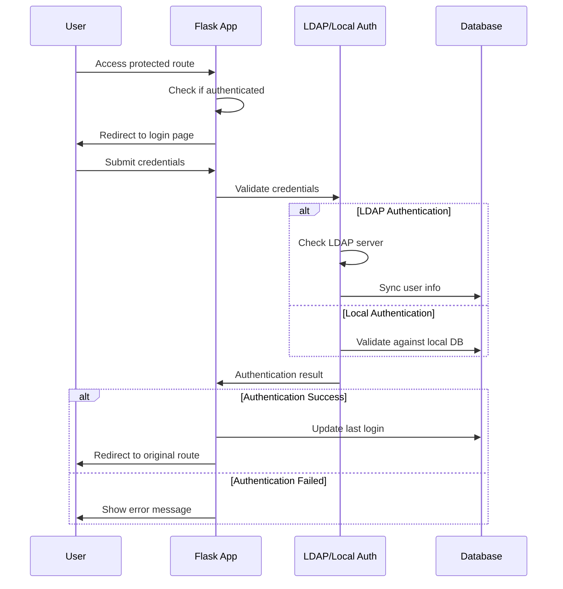
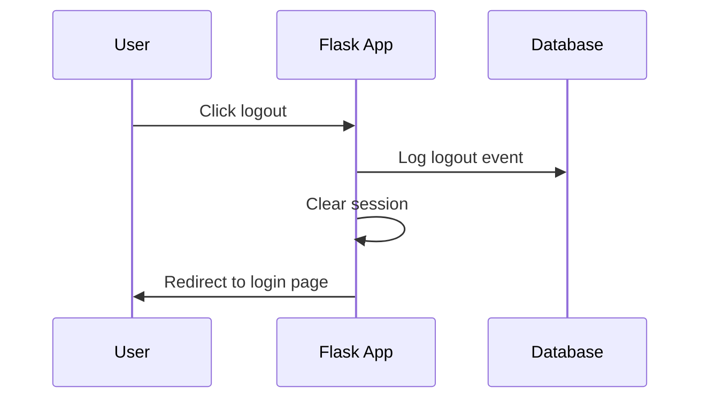
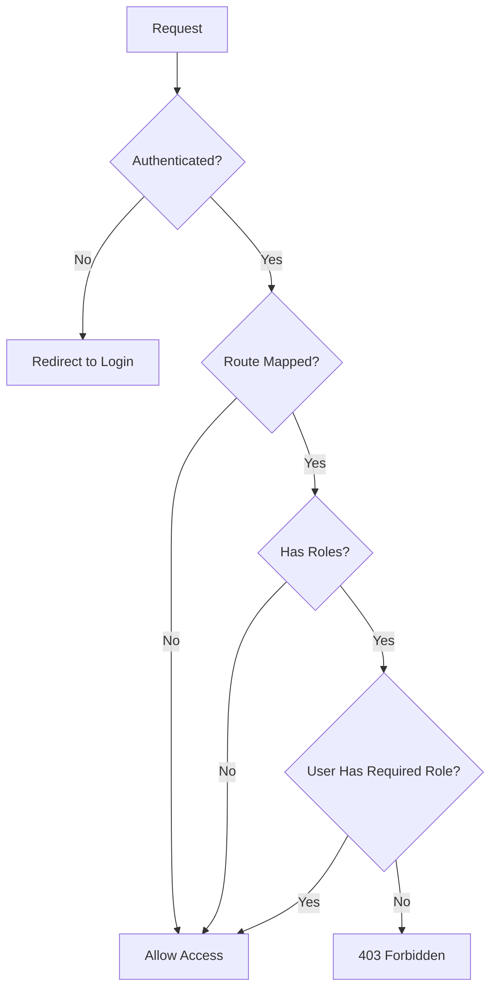
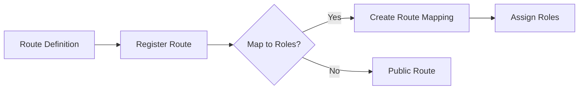
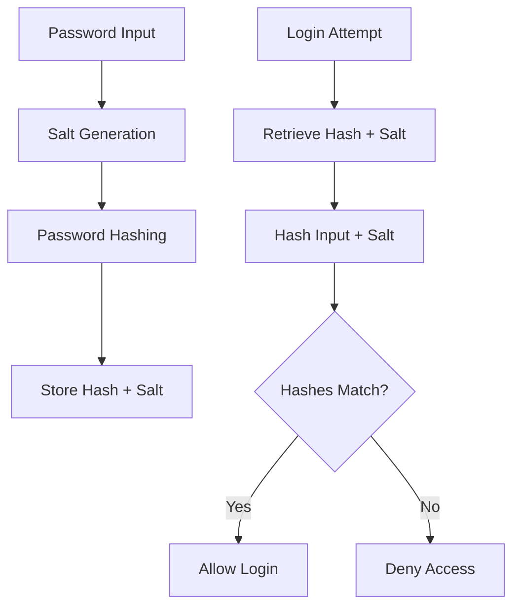
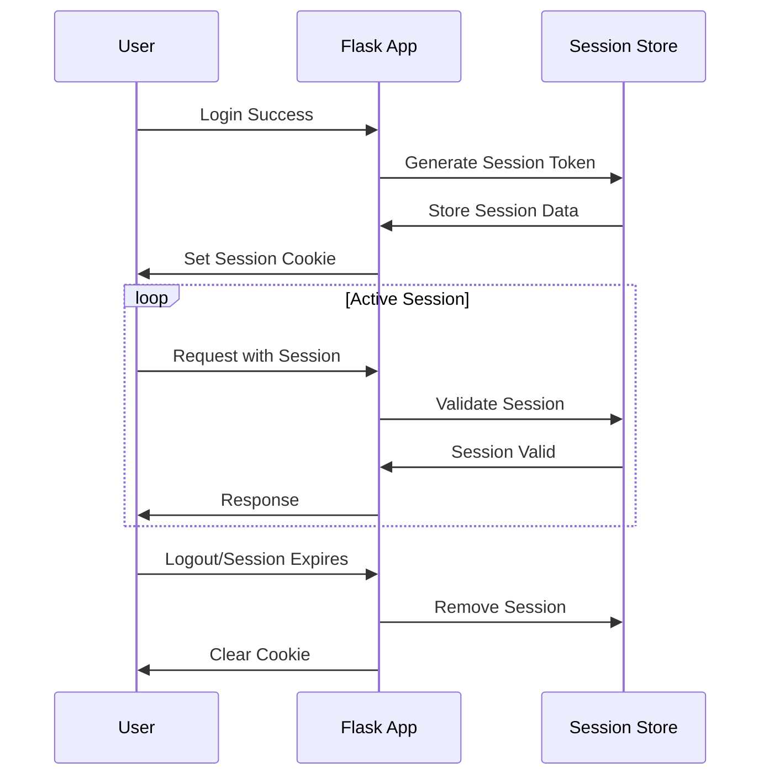

# Authentication and RBAC Guide

## Overview
This guide covers the authentication and Role-Based Access Control (RBAC) systems in the Flask Portal Application. It includes detailed flows for login/logout processes and how RBAC is implemented throughout the application.

## Authentication Flow

### Login Process


### Logout Process


## RBAC System

### Role Check Flow


### Route Registration and Role Mapping


## Implementation Details

### 1. Authentication Setup

#### Configuration
```python
# config.py
class Config:
    LDAP_PROVIDER_URL = 'ldap://ldap.example.com:389'
    LDAP_PROTOCOL_VERSION = 3
    LDAP_BASE_DN = 'dc=example,dc=com'
```

#### Login Handler
```python
@auth.route('/login', methods=['GET', 'POST'])
def login():
    if current_user.is_authenticated:
        return redirect(url_for('main.index'))
        
    form = LoginForm()
    if form.validate_on_submit():
        # Try LDAP first
        user = authenticate_ldap(form.username.data, form.password.data)
        if not user:
            # Try local auth
            user = User.query.filter_by(username=form.username.data).first()
            if not user or not user.check_password(form.password.data):
                flash('Invalid username or password')
                return redirect(url_for('auth.login'))
        
        login_user(user, remember=form.remember_me.data)
        track_login_activity(user)
        
        next_page = request.args.get('next')
        if not next_page or url_parse(next_page).netloc != '':
            next_page = url_for('main.index')
        return redirect(next_page)
        
    return render_template('login.html', form=form)
```

### 2. RBAC Implementation

#### Role Model
```python
class Role(db.Model):
    id = db.Column(db.Integer, primary_key=True)
    name = db.Column(db.String(80), unique=True)
    description = db.Column(db.String(255))
    
    # Many-to-many relationship with routes
    routes = db.relationship('Route', 
                           secondary='role_routes',
                           backref=db.backref('roles', lazy='dynamic'))
```

#### Route Mapping
```python
class RouteMapping(db.Model):
    id = db.Column(db.Integer, primary_key=True)
    route_path = db.Column(db.String(255), unique=True)
    roles = db.relationship('Role', 
                          secondary='route_roles',
                          backref=db.backref('route_mappings', lazy='dynamic'))
```

#### Role Required Decorator
```python
def role_required(roles):
    def decorator(f):
        @wraps(f)
        def decorated_function(*args, **kwargs):
            if not current_user.is_authenticated:
                return redirect(url_for('auth.login'))
                
            # Check if route requires roles
            route = RouteMapping.query.filter_by(
                route_path=request.endpoint
            ).first()
            
            if route and route.roles:
                if not any(role.name in roles for role in current_user.roles):
                    abort(403)
            return f(*args, **kwargs)
        return decorated_function
    return decorator
```

### 3. Usage Examples

#### Protecting Routes
```python
@app.route('/admin/users')
@login_required
@role_required(['admin'])
def admin_users():
    return render_template('admin/users.html')
```

#### Checking Roles in Templates
```html

    <a href="{{ url_for('admin.users') }}" class="nav-link">
        <i class="nav-icon fas fa-users"></i>
        <p>User Management</p>
    </a>

```

#### Role Assignment
```python
def assign_role_to_user(user, role_name):
    role = Role.query.filter_by(name=role_name).first()
    if role and role not in user.roles:
        user.roles.append(role)
        db.session.commit()
```

## Security Considerations

### Password Handling


### Session Management


## Best Practices

1. **Role Assignment**
   - Assign roles based on job function
   - Follow principle of least privilege
   - Regularly audit role assignments

2. **Route Protection**
   - Always protect sensitive routes
   - Use both @login_required and @role_required
   - Validate permissions server-side

3. **Session Security**
   - Use secure session configuration
   - Implement session timeout
   - Rotate session tokens

4. **Authentication**
   - Implement rate limiting
   - Use strong password policies
   - Log authentication failures

## Troubleshooting

### Common Issues

1. **Unable to Login**
   - Check LDAP configuration
   - Verify user exists in database
   - Check password hash algorithm

2. **Permission Denied**
   - Verify user roles
   - Check route mapping
   - Validate role requirements

3. **Session Issues**
   - Clear browser cookies
   - Check session configuration
   - Verify session store health

### Debugging Tips

1. Enable debug logging:
```python
logging.getLogger('auth').setLevel(logging.DEBUG)
```

2. Check role assignments:
```python
def debug_user_roles(username):
    user = User.query.filter_by(username=username).first()
    print(f"User: {user.username}")
    print("Roles:", [role.name for role in user.roles])
    print("Route Access:", [route.route_path for route in user.accessible_routes])
```

3. Validate route mappings:
```python
def validate_route_mappings():
    for route in RouteMapping.query.all():
        print(f"Route: {route.route_path}")
        print("Required Roles:", [role.name for role in route.roles])
