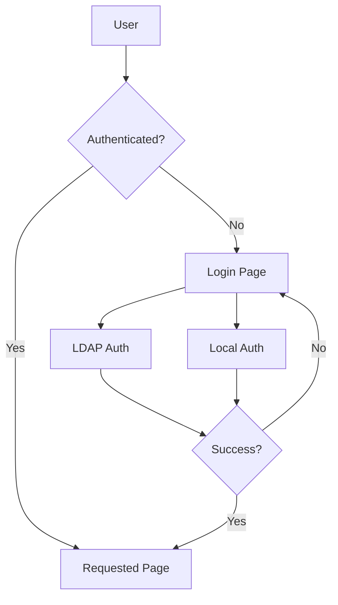
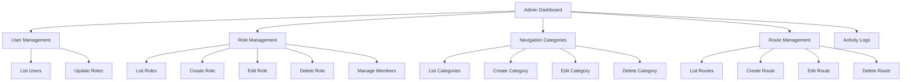
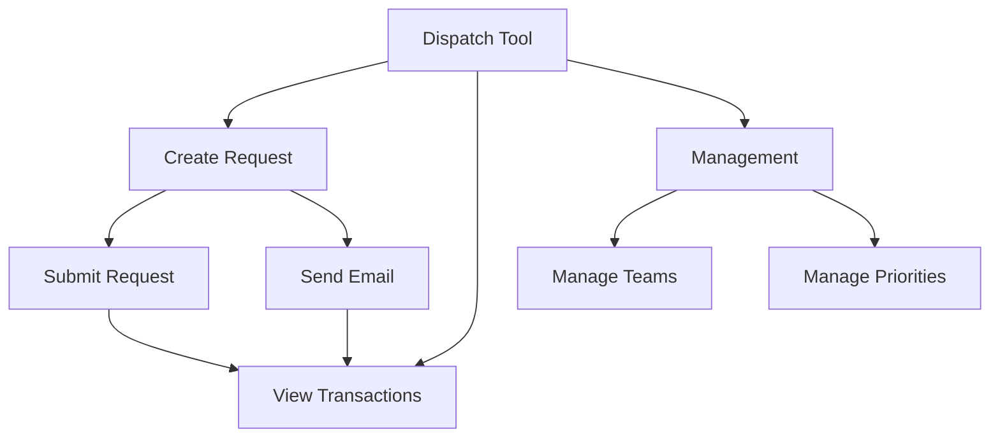
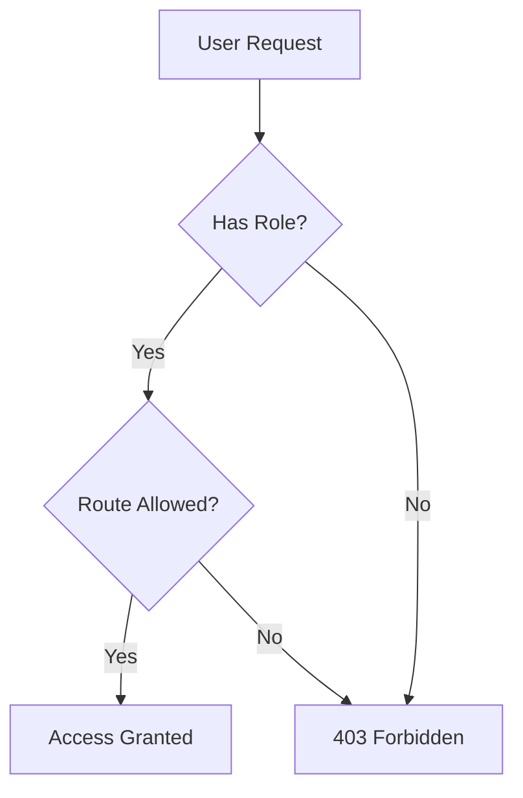

# Flask Portal Application

## Table of Contents
1. [Overview](#overview)
2. [Features](#features)
   - [Authentication](#authentication)
   - [Core Routes](#core-routes)
   - [Admin Plugin Routes](#admin-plugin-routes)
   - [Dispatch Plugin Routes](#dispatch-plugin-routes)
3. [Plugin System](#plugin-system)
4. [Role-Based Access Control (RBAC)](#role-based-access-control-rbac)
5. [Navigation System](#navigation-system)
6. [Activity Tracking](#activity-tracking)
7. [Development Setup](#development-setup)
8. [Contributing](#contributing)
9. [Plugin Documentation](#plugin-documentation)
   - [Profile Plugin](#profile-plugin)
   - [Dispatch Plugin](#dispatch-plugin)
   - [Hello Plugin](#hello-plugin)
   - [Handoff Plugin](#handoff-plugin)

## Overview
A Flask-based web application with role-based access control (RBAC), plugin system, comprehensive user activity tracking, and user preferences. Supports both LDAP and local authentication.

## Features

### Authentication
- **LDAP Authentication**
  - Uses test123 as default password for LDAP testing
- **Local Development Users**
  * admin:admin123 (admin role)
  * user:user123 (demo role)
- **Features**
  - Automatic redirection to login page
  - Post-login redirection to originally requested page
  - Session management
  - User activity tracking

### Core Routes
- **Authentication Routes**
  - `/login` - User login page (GET/POST)
  - `/logout` - User logout (GET)
- **Main Routes**
  - `/` - Main index page
- **Error Handlers**
  - `/400` - Bad Request error page
  - `/403` - Forbidden error page
  - `/404` - Not Found error page
  - `/500` - Internal Server error page

### Admin Plugin Routes
- **Dashboard**
  - `/admin/` - Admin dashboard overview
- **User Management**
  - `/admin/users` - List and manage users
  - `/admin/users/<id>/roles` - Update user roles (POST)
- **Role Management**
  - `/admin/roles` - List all roles
  - `/admin/roles/new` - Create new role
  - `/admin/roles/<id>/edit` - Edit existing role
  - `/admin/roles/<id>/delete` - Delete role
  - `/admin/roles/<id>/members` - View role members
  - `/admin/roles/<id>/members/add` - Add member to role
  - `/admin/roles/<id>/members/<user_id>/remove` - Remove member from role
- **Navigation Categories**
  - `/admin/categories` - List all categories
  - `/admin/categories/new` - Create new category
  - `/admin/categories/<id>/edit` - Edit category
  - `/admin/categories/<id>/delete` - Delete category
- **Route Management**
  - `/admin/routes` - List all routes
  - `/admin/routes/new` - Create new route mapping
  - `/admin/routes/<id>/edit` - Edit route mapping
  - `/admin/routes/<id>/delete` - Delete route mapping
- **Activity Logs**
  - `/admin/logs` - View system activity logs
- **API Endpoints**
  - `/admin/icons` - Get available FontAwesome icons
  - `/admin/routes/list` - Get available routes for Select2
  - `/admin/category/<id>/icon` - Get category icon

### Dispatch Plugin Routes
- **Main Interface**
  - `/dispatch/` - Main dispatch tool page
  - `/dispatch/submit` - Submit dispatch request (POST)
  - `/dispatch/transactions` - Get transactions list
- **Management**
  - `/dispatch/manage` - Manage teams and priorities
  - `/dispatch/team` - Add/update team (POST)
  - `/dispatch/priority` - Add/update priority (POST)

## Plugin System
The application uses a modular plugin system where each plugin:
- Has its own routes, templates, and static files
- Is automatically registered via blueprints
- Can have plugin-specific configuration
- Integrates with the core RBAC system
- Can extend the navigation system

## Role-Based Access Control (RBAC)
- Centralized access control through route mapping
- Dynamic permission checking
- Flexible role assignment
- Route-level access control
- Support for multiple roles per user

## Navigation System
- Hierarchical navigation with categories
- Dynamic menu generation based on user roles
- Customizable menu ordering
- Icon support
- Breadcrumb navigation

## Activity Tracking
- Comprehensive user activity logging
- Page visit tracking
- Action tracking with timestamps
- User session monitoring
- Activity reports and analytics

## Development Setup
1. Clone the repository
2. Create a virtual environment: `python -m venv venv`
3. Activate the virtual environment:
   - Windows: `venv\Scripts\activate`
   - Unix/MacOS: `source venv/bin/activate`
4. Install dependencies: `pip install -r requirements.txt`
5. Copy `.env.example` to `.env` and configure
6. Initialize database: `flask db upgrade`
7. Run the application: `flask run`

## Contributing
1. Fork the repository
2. Create a feature branch
3. Commit your changes
4. Push to the branch
5. Create a Pull Request

## Plugin Documentation

### Profile Plugin

A Flask plugin for managing user profiles including avatar customization and theme preferences.

#### Features
- Custom avatar upload with size and type validation
- Selection from predefined avatar gallery
- Theme preference management (light/dark mode)
- AJAX-based theme switching
- Automatic avatar directory creation
- Secure file handling
- Activity tracking integration
- User preference persistence
- Random default avatar assignment

[View Full Profile Plugin Documentation](app/plugins/profile/README.md)

### Dispatch Plugin

A Flask plugin for managing and tracking dispatch requests with email notifications.

#### Features
- Create and send dispatch requests to teams
- Track dispatch transactions with priority levels
- Email notifications for new dispatch requests
- Admin interface for managing teams and priorities
- DataTables integration for viewing transactions
- Role-based access control
- Color-coded priorities with custom icons
- Comprehensive activity tracking and logging
- Error handling with status tracking
- Customizable email templates

[View Full Dispatch Plugin Documentation](app/plugins/dispatch/README.md)

### Hello Plugin

An example plugin demonstrating the Flask plugin system functionality.

#### Features
- Displays plugin metadata and configuration
- Demonstrates plugin routing system
- Shows role-based access control
- Integrates activity tracking
- Uses Bootstrap UI components
- Implements FontAwesome icons
- Demonstrates breadcrumb navigation
- Shows plugin information display

[View Full Hello Plugin Documentation](app/plugins/hello/README.md)

### Handoff Plugin

A Flask plugin for managing shift handoffs between teams with comprehensive tracking and analytics.

#### Features
- Create and manage shift handoffs with priority levels
- Track tickets, hostnames, and KIRKE references
- Support for bridge links and due dates
- Detailed metrics and analytics dashboard
- Shift-based assignment system (1st, 2nd, 3rd shifts)
- Real-time status updates
- Comprehensive activity tracking
- DataTables integration for handoff management
- Advanced metrics visualization
- Time-based analytics and reporting

[View Full Handoff Plugin Documentation](app/plugins/handoffs/README.md)
