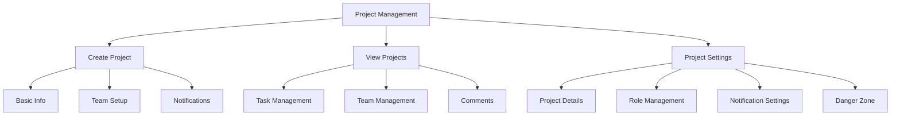

# Flask Portal Application

[Previous content remains exactly the same until the end]

### Projects Plugin

A Flask plugin for comprehensive project management with task tracking and team collaboration features.

#### Features
- **Project Management**
  - Create and manage projects with detailed descriptions
  - Track project status (active, on hold, completed, archived)
  - Assign project leads and team members
  - Define project roles (watchers, stakeholders, shareholders)
  - Project settings management
  - Archive and delete functionality

- **Task Management**
  - Create and assign tasks with priorities
  - Track task status and due dates
  - Task completion tracking
  - Task history and activity logging

- **Team Collaboration**
  - Multiple role types (lead, team member, watcher, etc.)
  - Comment system for discussions
  - Todo lists for quick task tracking
  - Team member assignment tracking

- **Notification System**
  - Configurable notification settings
  - Notifications for task creation/completion
  - Comment notifications
  - Team member activity tracking

- **Project Analytics**
  - Task completion statistics
  - Due date tracking
  - Team member contribution tracking
  - Project history and activity logs

[View Full Projects Plugin Documentation](app/plugins/projects/README.md)
