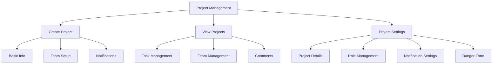

# Flask Portal Application

## Quick Start

1. Clone the repository
2. Create a virtual environment and activate it:
```bash
python -m venv venv
source venv/bin/activate  # On Windows use: venv\Scripts\activate
```
3. Install dependencies:
```bash
pip install -r requirements.txt
```
4. Run the setup script to initialize everything:
```bash
python setup.py
```

The setup script will:
- Create necessary directories
- Initialize the database
- Run all migrations
- Set up default roles and users
- Configure route permissions
- Initialize plugin settings

5. Run the application:
```bash
flask run
```
6. Access the application at http://localhost:5000

Default admin credentials:
- Username: admin
- Password: test123

## Database Configuration

The application uses SQLite by default for easy setup and portability. The SQLite database will be automatically created in the `instance` directory when you run the setup script.

### Migrating to MariaDB

If you want to switch from SQLite to MariaDB, we provide a simple migration script that will guide you through the process:

1. Ensure MariaDB is installed and running on your system
2. Run the migration script:
```bash
python migrate_to_mariadb.py
```
3. Follow the prompts to enter your MariaDB connection details:
   - Host (default: localhost)
   - Port (default: 3306)
   - Database name (default: portal_db)
   - Username
   - Password

The script will:
- Test the database connection
- Create the database if it doesn't exist
- Update your .env file with the MariaDB configuration
- Migrate your existing data to the new database

If you prefer to configure MariaDB manually, you can set the following environment variables in a `.env` file:

```env
DB_TYPE=mariadb
DATABASE_USER=your_user
DATABASE_PASSWORD=your_password
DATABASE_HOST=localhost
DATABASE_PORT=3306
DATABASE_NAME=your_db_name
```

### Projects Plugin

A Flask plugin for comprehensive project management with task tracking and team collaboration features.

#### Features
- **Project Management**
  - Create and manage projects with detailed descriptions
  - Track project status (active, on hold, completed, archived)
  - Assign project leads and team members
  - Define project roles (watchers, stakeholders, shareholders)
  - Project settings management
  - Archive and delete functionality

- **Task Management**
  - Create and assign tasks with priorities
  - Track task status and due dates
  - Task completion tracking
  - Task history and activity logging

- **Team Collaboration**
  - Multiple role types (lead, team member, watcher, etc.)
  - Comment system for discussions
  - Todo lists for quick task tracking
  - Team member assignment tracking

- **Notification System**
  - Configurable notification settings
  - Notifications for task creation/completion
  - Comment notifications
  - Team member activity tracking

- **Project Analytics**
  - Task completion statistics
  - Due date tracking
  - Team member contribution tracking
  - Project history and activity logs



[View Full Projects Plugin Documentation](app/plugins/projects/README.md)
