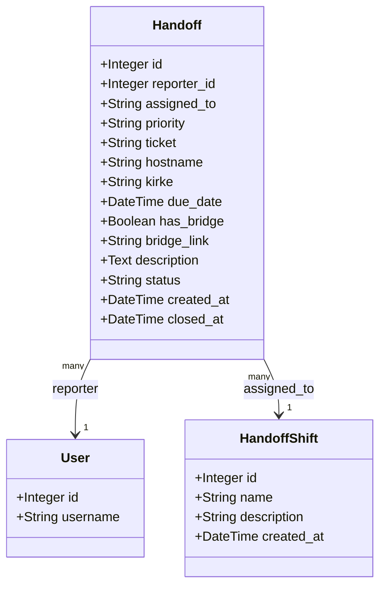
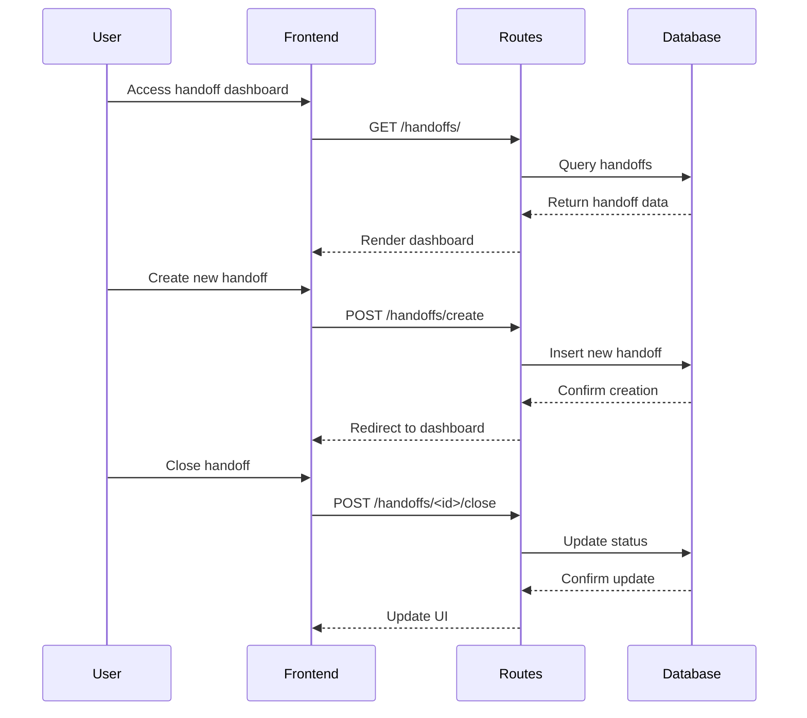
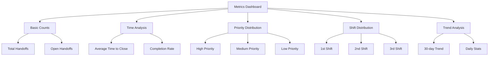

# Handoff Management Plugin

A Flask plugin for managing shift handoffs between teams. This plugin provides a comprehensive system for creating, tracking, and analyzing shift handovers with detailed metrics and statistics.

## Features

- Create and manage shift handoffs with priority levels
- Track tickets, hostnames, and KIRKE references
- Support for bridge links and due dates
- Detailed metrics and analytics dashboard
- Shift-based assignment system (1st, 2nd, 3rd shifts)
- Real-time status updates

## Architecture



## Data Flow



## Metrics System



## Installation

1. Ensure the plugin directory is in your Flask application's plugins folder
2. Register the plugin in your Flask application:

```python
from app.plugins.handoffs import bp as handoffs_bp
app.register_blueprint(handoffs_bp, url_prefix='/handoffs')
```

3. Run database migrations to create necessary tables:

```bash
flask db upgrade
```

## Usage

### Creating a Handoff

1. Navigate to `/handoffs/create`
2. Fill in the required information:
   - Assigned shift (1st, 2nd, or 3rd)
   - Priority level
   - Description
3. Optional fields:
   - Ticket number
   - Hostname
   - KIRKE reference
   - Due date
   - Bridge link

### Viewing Handoffs

- Access the main dashboard at `/handoffs/`
- View metrics and statistics at `/handoffs/metrics`

### API Endpoints

| Endpoint | Method | Description |
|----------|--------|-------------|
| `/handoffs/` | GET | Display handoff dashboard |
| `/handoffs/create` | GET/POST | Create new handoff |
| `/handoffs/metrics` | GET | View metrics dashboard |
| `/handoffs/<id>/close` | POST | Close a handoff |

## Database Schema

```mermaid
erDiagram
    HANDOFF {
        int id PK
        int reporter_id FK
        string assigned_to
        string priority
        string ticket
        string hostname
        string kirke
        datetime due_date
        boolean has_bridge
        string bridge_link
        text description
        string status
        datetime created_at
        datetime closed_at
    }
    
    HANDOFF_SHIFT {
        int id PK
        string name
        string description
        datetime created_at
    }
    
    USER {
        int id PK
        string username
    }
    
    HANDOFF ||--o{ USER : "reported by"
    HANDOFF ||--o{ HANDOFF_SHIFT : "assigned to"
