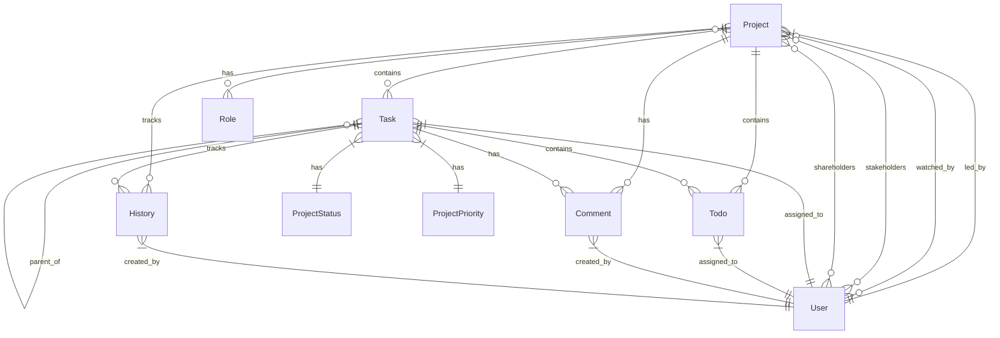
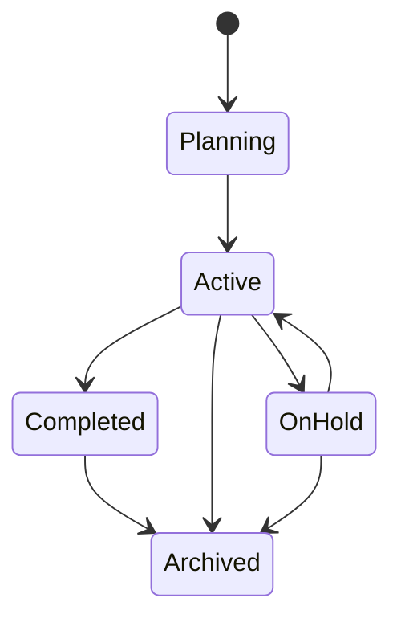
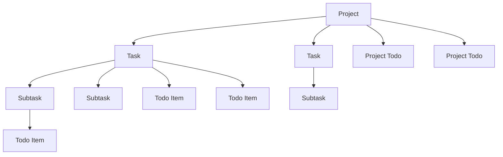

# Projects Plugin Architecture

This document provides a comprehensive overview of the Projects plugin architecture, functionality, and relationships.

## Overview

The Projects plugin is a powerful task management system that supports:
- Project management with hierarchical tasks
- Todo items for both projects and tasks
- Status and priority management
- User roles and permissions
- Activity tracking and history
- Comments and notifications
- Flexible assignment capabilities

## Entity Relationship Diagram

## Project Workflow States

## Task Management Structure

## Core Components

### Project Model
- Central entity for organizing work
- Supports private/public visibility
- Configurable notification settings
- Tracks completion percentage
- Maintains activity history

### Task Model
- Hierarchical structure supporting subtasks
- Status and priority tracking
- Due date management
- Assignment capabilities
- Comment thread support

### Todo Model
- Checklist functionality for both projects and tasks
- Due date tracking
- Assignment capabilities
- Order management for prioritization

### Comment System
- Threaded discussions on projects and tasks
- User attribution
- Timestamp tracking
- Avatar support

### History Tracking
- Comprehensive change logging
- Action categorization (created, updated, deleted, etc.)
- JSON-based detail storage
- User attribution

## User Roles and Relationships

### Project Roles
1. **Lead**: Primary project manager
2. **Watchers**: Users following project updates
3. **Stakeholders**: Key decision makers
4. **Shareholders**: Extended team members

### Access Control
- Private/Public project visibility
- Role-based access control
- Granular notification settings

## Status and Priority Management

### Status Configuration
- Customizable status definitions
- Color coding support
- Progress tracking

### Priority Levels
- Configurable priority levels
- Visual indicators
- Impact on task organization

## Notification System

The plugin supports configurable notifications for:
- Task creation
- Task completion
- Comment activity
- Status changes
- Assignment updates

## Technical Implementation

### Database Schema
- Leverages SQLAlchemy ORM
- Implements proper foreign key relationships
- Supports cascading deletions
- Maintains data integrity

### API Structure
- RESTful endpoints
- JSON response formatting
- Proper error handling
- Activity logging

### Frontend Integration
- Bootstrap styling support
- Dynamic UI updates
- Real-time status indicators
- Interactive task management

## Future Improvements

1. **Enhanced Reporting**
   - Burndown charts
   - Velocity tracking
   - Time estimation

2. **Advanced Features**
   - File attachments
   - Time tracking
   - Custom fields
   - Template support

3. **Integration Capabilities**
   - Calendar sync
   - Email integration
   - API webhooks
   - External tool connections

This document will be continuously updated as new features and improvements are added to the Projects plugin.
