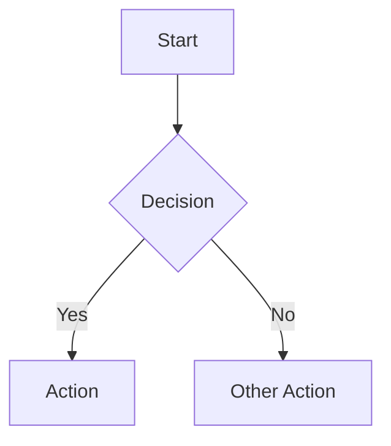

# Documentation Guidelines

This directory contains the complete documentation for the Black Friday Lunch application. These guidelines will help you maintain and update the documentation effectively.

## Directory Structure

```
docs/
├── README.md           # This file
├── index.md           # Main documentation index
├── manual.md          # Complete system manual
├── plugin_template.md # Template for plugin documentation
└── plugins/           # Plugin-specific documentation
    └── profile.md     # Profile plugin documentation
```

## Writing Guidelines

### 1. Accessibility and Clarity
- Write in clear, straightforward language
- Make content accessible to all users
- Avoid unnecessary technical jargon
- Define technical terms when they must be used
- Focus on practical, easy-to-follow explanations

### 2. Document Structure
- Start with a clear overview
- Use consistent headings
- Include practical examples
- Add diagrams where helpful
- End with related resources

### 3. Formatting Standards
- Use Markdown formatting
- Keep line lengths readable
- Use code blocks for examples
- Include mermaid diagrams for visuals

### 4. Documentation Types

#### Plugin Documentation
- Use plugin_template.md as your base
- Include all required sections
- Add plugin-specific examples
- Document all features
- Include troubleshooting guides

#### Technical Documentation
- Include code examples
- Explain configuration options
- Document API endpoints
- List dependencies
- Include security considerations

#### User Guides
- Include step-by-step instructions
- Add screenshots where helpful
- List common issues and solutions
- Provide clear examples

## Mermaid Diagrams

Use Mermaid diagrams for:
- Workflows
- Database schemas
- System architecture
- Plugin relationships

Example:


## Code Examples

Format code examples like this:

```python
# Python example
def example_function():
    """Include docstrings in examples."""
    return "Hello, World!"
```

```javascript
// JavaScript example
function exampleFunction() {
  // Include comments in examples
  return "Hello, World!";
}
```

## Updating Documentation

1. Create/Update Content
   - Use appropriate template
   - Follow writing guidelines
   - Include all required sections

2. Review Process
   - Check spelling and grammar
   - Verify technical accuracy
   - Ensure content is clear and accessible
   - Test any included examples

3. Update Index
   - Add new documents to index.md
   - Update any related links
   - Check navigation paths

## Best Practices

1. Keep It Current
   - Update docs with code changes
   - Review regularly
   - Remove outdated information

2. Be Consistent
   - Use same terms throughout
   - Follow templates
   - Maintain style guidelines

3. Focus on User Understanding
   - Explain why, not just how
   - Include real-world examples
   - Address common questions
   - Break down complex concepts into simple steps

4. Use Visual Aids
   - Add diagrams for complex concepts
   - Include screenshots for UI features
   - Use tables for structured data

## Contributing

1. Fork the repository
2. Create your documentation branch
3. Follow these guidelines
4. Submit a pull request

## Tools and Resources

- [Readable](https://readable.com/) - Check content clarity
- [Mermaid Live Editor](https://mermaid-js.github.io/mermaid-live-editor/) - Create diagrams
- [Markdown Guide](https://www.markdownguide.org/) - Markdown reference

## Questions?

If you have questions about documentation:
1. Check existing docs
2. Review these guidelines
3. Ask the Portal Team

Remember: Good documentation is clear, accessible, and helpful to all users!
