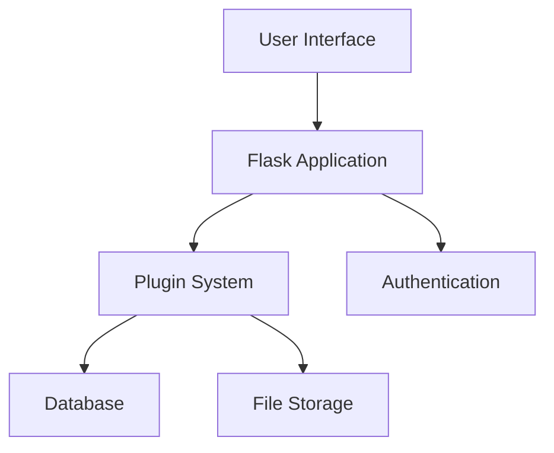
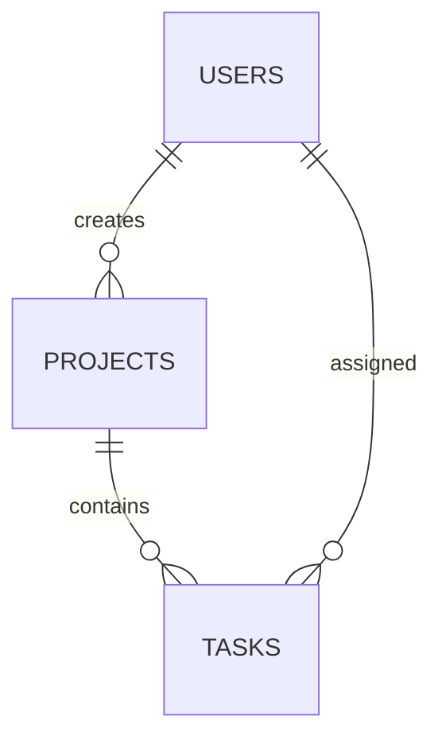
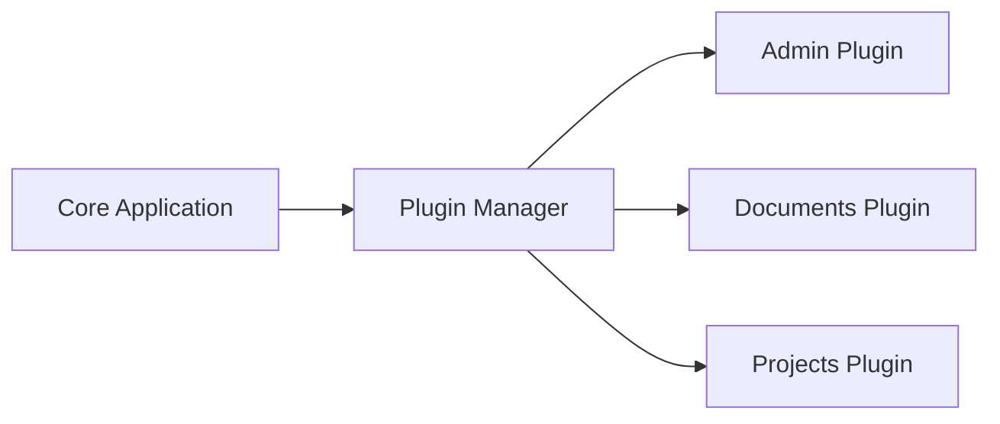
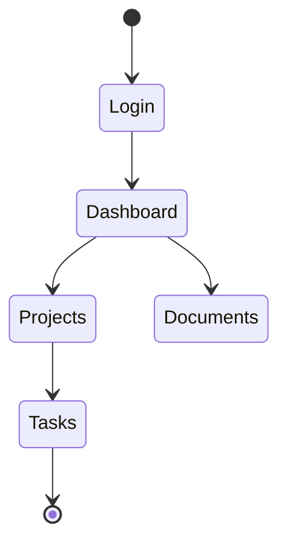

# Black Friday Lunch Application Manual

## Introduction

Welcome to the Black Friday Lunch application! This manual will help you understand how to use and work with our system. We've written this guide to be easy to understand, even if you're not a technical expert.

## Table of Contents

1. Getting Started
2. Core Features
3. Plugins
4. Technical Details
5. Appendices

## 1. Getting Started

### What is Black Friday Lunch?

Black Friday Lunch is a web application that helps teams manage their work and collaborate effectively. Think of it as your team's central hub for handling tasks, documents, and important information.

### Quick Start Guide

1. Setting up your account
2. Navigating the dashboard
3. Basic operations

## 2. Core Features

### User Management
- Creating your profile
- Setting preferences
- Managing notifications

### Navigation
- Understanding the menu
- Using the dashboard
- Finding what you need

## 3. Plugins

### Admin Plugin
- Managing users
- System settings
- Access control

### Dispatch Plugin
- What is dispatch?
- Creating dispatch entries
- Managing dispatch workflow

### Documents Plugin
- Storing documents
- Organizing files
- Sharing and permissions

### Handoffs Plugin
- Creating handoffs
- Managing transitions
- Best practices

### OnCall Plugin
- Setting up schedules
- Managing rotations
- Handling alerts

### Profile Plugin
- Customizing your profile
- Setting preferences
- Managing personal settings

### Projects Plugin
- Creating projects
- Task management
- Team collaboration

### Reports Plugin
- Available reports
- Creating custom reports
- Scheduling reports

### Tracking Plugin
- Activity monitoring
- Performance metrics
- Usage statistics

## 4. Technical Details

### System Architecture

### Database Structure

### Plugin System

## 5. Appendices

### Appendix A: Glossary
- Common terms and definitions
- Technical terminology explained
- Acronyms and abbreviations

### Appendix B: Troubleshooting
- Common issues
- Solutions and workarounds
- Getting help

### Appendix C: Code Examples
[To be filled with specific code examples and snippets]

### Appendix D: API Documentation
[To be filled with API endpoints and usage]

### Appendix E: Configuration Reference
[To be filled with configuration options and settings]

### Appendix F: Workflow Diagrams

## Note to Contributors

This manual is a living document that will be updated regularly. We will add more detailed information, examples, and diagrams as we continue to develop and improve the system.

Future sections to be added:
1. Detailed plugin configuration guides
2. More code examples and snippets
3. Advanced usage scenarios
4. Performance optimization tips
5. Security best practices
