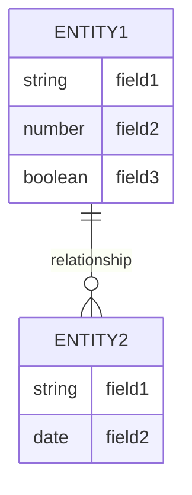
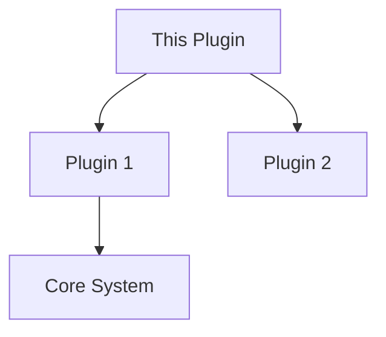

# Plugin Documentation Template

## Overview

[A brief description of what this plugin does and its main purpose]

## Features

- Feature 1
- Feature 2
- Feature 3

## Installation

1. Prerequisites
2. Installation steps
3. Configuration requirements

## Usage

### Basic Usage

```python
# Example code showing basic usage
```

### Common Tasks

1. Task 1
   - Step-by-step instructions
   - Expected outcome

2. Task 2
   - Step-by-step instructions
   - Expected outcome

## Configuration

### Settings

| Setting Name | Type | Default | Description |
|-------------|------|---------|-------------|
| setting1    | str  | None    | Description |
| setting2    | bool | False   | Description |

### Environment Variables

| Variable Name | Required | Description |
|--------------|----------|-------------|
| VARIABLE_1   | Yes      | Description |
| VARIABLE_2   | No       | Description |

## Database Schema



## API Reference

### Endpoints

#### GET /api/plugin/endpoint1

Description of what this endpoint does.

**Parameters:**
- param1 (type): description
- param2 (type): description

**Response:**
```json
{
    "field1": "value1",
    "field2": "value2"
}
```

## Integration

### With Other Plugins



### Event Hooks

| Event Name | Description | Parameters |
|------------|-------------|------------|
| event1     | Description | param1, param2 |
| event2     | Description | param1 |

## Troubleshooting

### Common Issues

1. Issue 1
   - Symptoms
   - Cause
   - Solution

2. Issue 2
   - Symptoms
   - Cause
   - Solution

## Examples

### Example 1: Basic Implementation

```python
# Code example 1
```

### Example 2: Advanced Usage

```python
# Code example 2
```

## Security Considerations

- Security point 1
- Security point 2
- Security point 3

## Performance Tips

1. Tip 1
   - Description
   - Implementation

2. Tip 2
   - Description
   - Implementation

## Changelog

### Version History

| Version | Date | Changes |
|---------|------|---------|
| 1.0.0   | DATE | Initial release |
| 1.1.0   | DATE | Added feature X |

## Support

- Where to get help
- How to report issues
- Contact information

## Contributing

- How to contribute
- Code style guidelines
- Testing requirements

## License

[License information]

---

Note: This template should be customized for each plugin while maintaining a consistent structure across all plugin documentation.
