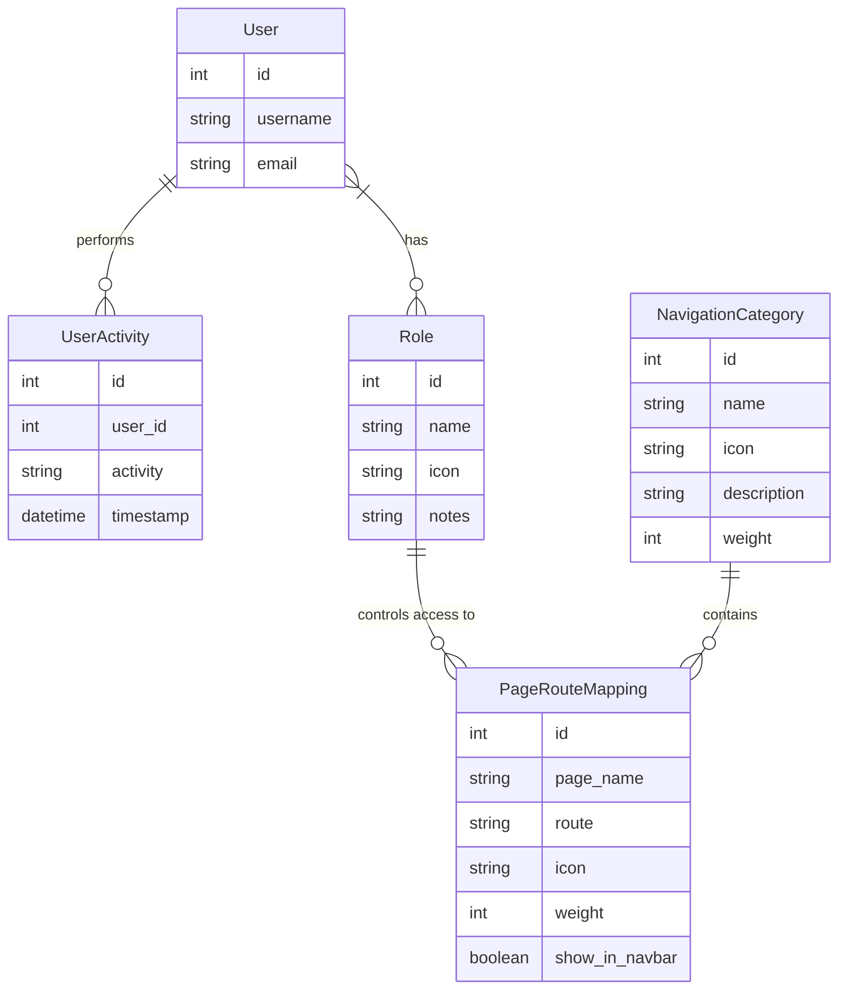
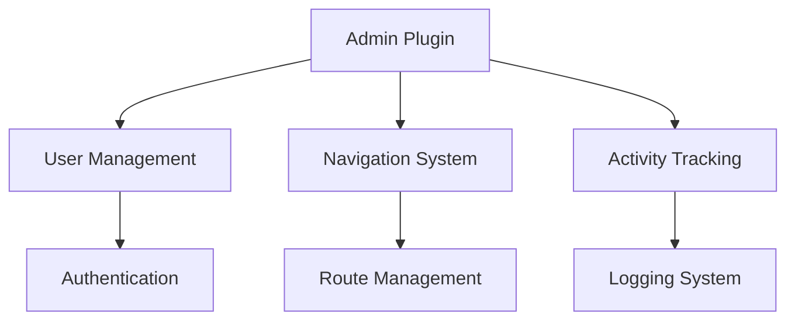

# Admin Plugin Documentation

## Overview

The Admin Plugin provides a comprehensive administrative interface for managing system-wide configurations including user roles, navigation routes, and activity monitoring. It serves as the central control panel for system administrators to manage access control, navigation structure, and monitor system usage.

## Features

- User Management
  - View all system users
  - Assign/remove user roles
  - Monitor user activities

- Role Management
  - Create, edit, and delete roles
  - Manage role permissions
  - View role members
  - Assign icons and notes to roles

- Navigation Management
  - Create and manage navigation categories
  - Configure route mappings
  - Control menu structure and ordering
  - Set visibility and access permissions

- Activity Monitoring
  - Track user actions
  - View system logs
  - Monitor recent activities
  - Filter activities by date range

## Installation

1. Prerequisites
   - Flask application with SQLAlchemy
   - Flask-Login for authentication
   - Database with user and role models

2. Installation Steps
   ```python
   # Register the blueprint in your Flask application
   from app.plugins.admin import bp as admin_bp
   app.register_blueprint(admin_bp)
   ```

3. Configuration Requirements
   - Admin role must exist in the system
   - Database migrations must be run to create required tables

## Usage

### Basic Usage

```python
# Access admin dashboard
@app.route('/admin')
@login_required
@requires_roles('admin')
def admin_dashboard():
    return render_template('admin/index.html')
```

### Common Tasks

1. Managing User Roles
   - Navigate to Admin Dashboard > Users
   - Select a user to modify
   - Check/uncheck roles as needed
   - Changes are saved automatically

2. Creating Navigation Categories
   - Go to Admin Dashboard > Categories
   - Click "New Category"
   - Fill in name, icon, description
   - Set weight for ordering
   - Save changes

## Configuration

### Settings

| Setting Name | Type | Default | Description |
|-------------|------|---------|-------------|
| url_prefix | str | /admin | URL prefix for admin routes |
| template_folder | str | templates | Location of admin templates |
| required_roles | list | ["admin"] | Roles required to access admin |

### Environment Variables

| Variable Name | Required | Description |
|--------------|----------|-------------|
| FLASK_APP | Yes | Flask application instance |
| DATABASE_URL | Yes | Database connection string |

## Database Schema



## API Reference

### Endpoints

#### GET /admin/
Dashboard overview with system statistics

#### GET /admin/users
List all users and their roles

#### POST /admin/users/{id}/roles
Update roles for a specific user

#### GET /admin/roles
List all roles and their permissions

#### POST /admin/roles/new
Create a new role

#### GET /admin/categories
List all navigation categories

#### GET /admin/routes
List all route mappings

#### GET /admin/logs
View system activity logs

## Integration

### With Other Plugins



### Event Hooks

| Event Name | Description | Parameters |
|------------|-------------|------------|
| user_role_updated | Triggered when user roles change | user_id, old_roles, new_roles |
| route_created | Triggered when new route is added | route_id, route_data |
| activity_logged | Triggered on new activity log | activity_id, user_id, action |

## Troubleshooting

### Common Issues

1. Access Denied
   - Symptoms: 403 Forbidden error
   - Cause: User lacks admin role
   - Solution: Assign admin role to user

2. Route Conflicts
   - Symptoms: Route already exists error
   - Cause: Duplicate route paths
   - Solution: Choose unique route path

## Security Considerations

- All routes require admin role authentication
- Activity logging for audit trails
- Role-based access control (RBAC)
- Session validation
- CSRF protection on forms
- Input validation and sanitization

## Performance Tips

1. Activity Log Management
   - Regularly archive old logs
   - Index timestamp columns
   - Implement log rotation

2. Route Cache
   - Cache navigation structure
   - Implement route mapping cache
   - Use efficient database queries

## Changelog

### Version History

| Version | Date | Changes |
|---------|------|---------|
| 1.0.0 | Initial | First release with core features |
| 1.1.0 | Update | Added activity logging |
| 1.2.0 | Update | Enhanced role management |

## Support

- Report issues through the issue tracker
- Contact system administrators for urgent issues
- Documentation available in admin dashboard

## Contributing

- Follow Flask blueprint conventions
- Maintain consistent code style
- Add tests for new features
- Update documentation
- Submit pull requests for review

## License

This plugin is part of the core system and follows the main project's license terms.

---

Note: This documentation assumes basic familiarity with Flask and web application concepts. For detailed implementation examples, refer to the code comments and inline documentation.
