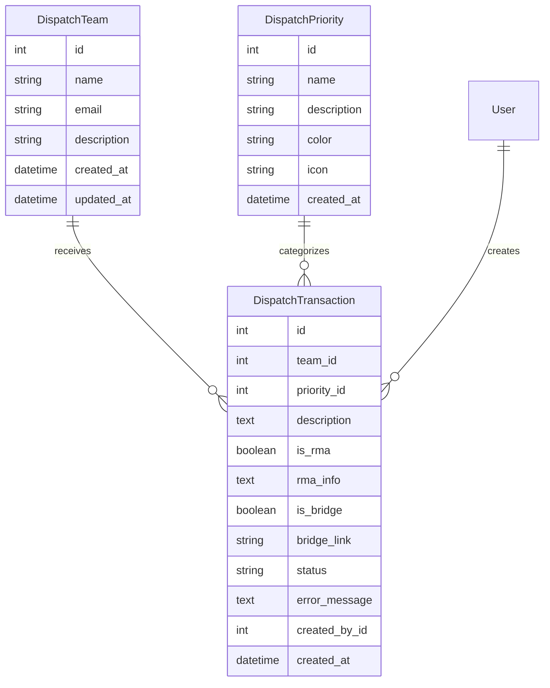
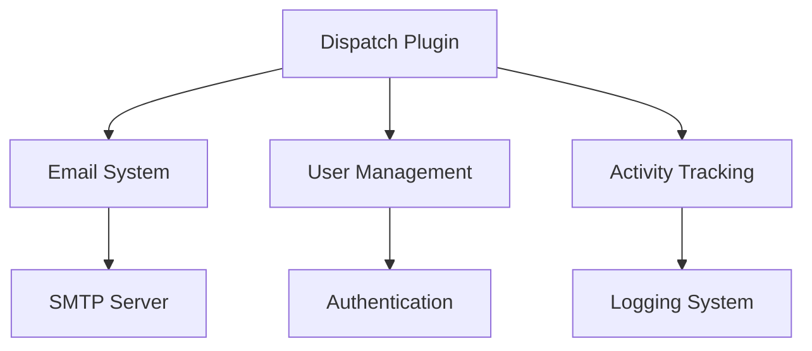

# Dispatch Plugin Documentation

## Overview

The Dispatch Plugin provides a robust system for managing and tracking dispatch requests with automated email notifications. It enables users to send structured dispatch requests to different teams, with customizable priorities and optional RMA (Return Merchandise Authorization) or bridge call information.

## Features

- Dispatch Request Management
  - Create and send dispatch requests
  - Configure teams and priorities
  - Track request status
  - Email notifications
  - Form validation and data integrity
  
- Team Management
  - Create and edit dispatch teams
  - Configure team email addresses
  - Team description and metadata
  - Input validation for team data
  
- Priority System
  - Customizable priority levels
  - Color-coded priorities
  - Priority-specific icons
  - Validation for color codes and icons
  
- Additional Features
  - RMA tracking support
  - Bridge call integration
  - Transaction history
  - Status tracking

## Installation

1. Prerequisites
   - Flask application with SQLAlchemy
   - SMTP server configuration
   - Email settings in application config
   - Flask-WTF for form validation

2. Installation Steps
   ```python
   # Register the blueprint in your Flask application
   from app.plugins.dispatch import bp as dispatch_bp
   app.register_blueprint(dispatch_bp)
   
   # Initialize the plugin
   from app.plugins.dispatch import init_app
   init_app(app)
   ```

3. Configuration Requirements
   ```python
   # Required email configuration in config.py
   MAIL_SERVER = 'smtp.example.com'
   MAIL_PORT = 587
   MAIL_USE_TLS = True
   MAIL_USERNAME = 'username'
   MAIL_PASSWORD = 'password'
   MAIL_DEFAULT_SENDER = 'dispatch@example.com'
   ```

## Form Validation

### Dispatch Request Form

The dispatch request form includes comprehensive validation:

- Required Fields:
  - Team selection
  - Priority selection
  - Description (1-2000 characters)

- Optional Fields with Validation:
  - RMA Information
    - Required when RMA is enabled
    - Maximum 1000 characters
  - Bridge Link
    - Required when bridge is enabled
    - Must be a valid URL
    - Maximum 512 characters

### Team Management Form

Team form validation ensures:

- Required Fields:
  - Team Name (1-64 characters)
  - Email Address (valid email format, max 120 characters)

- Optional Fields:
  - Description (max 256 characters)

### Priority Management Form

Priority form validation includes:

- Required Fields:
  - Priority Name (1-32 characters)
  - Color (valid hex code format, e.g., #FF0000)
  - Icon Class (1-32 characters)

- Optional Fields:
  - Description (max 256 characters)

## Usage

### Basic Usage

```python
# Create a new dispatch request
from app.plugins.dispatch.models import DispatchTransaction

transaction = DispatchTransaction(
    team_id=1,
    priority_id=1,
    description="Urgent system maintenance required",
    created_by_id=current_user.id
)
db.session.add(transaction)
db.session.commit()
```

### Common Tasks

1. Sending a Dispatch Request
   - Navigate to Dispatch Tool
   - Select target team
   - Choose priority level
   - Enter description (required, max 2000 chars)
   - Add RMA/Bridge info if needed
   - Form validates input before submission
   - Submit request

2. Managing Teams
   - Access management interface
   - Add/edit team details
   - Configure team email (valid format required)
   - Input validation ensures data integrity
   - Save changes

## Configuration

### Settings

| Setting Name | Type | Default | Description |
|-------------|------|---------|-------------|
| url_prefix | str | /dispatch | URL prefix for dispatch routes |
| required_roles | list | ["user", "admin"] | Roles allowed to use dispatch |
| category | str | "Tools" | Navigation category |
| weight | int | 100 | Navigation menu weight |

### Environment Variables

| Variable Name | Required | Description |
|--------------|----------|-------------|
| MAIL_SERVER | Yes | SMTP server address |
| MAIL_PORT | Yes | SMTP server port |
| MAIL_USERNAME | Yes | SMTP authentication username |
| MAIL_PASSWORD | Yes | SMTP authentication password |

## Database Schema



## API Reference

### Endpoints

#### GET /dispatch/
Main dispatch interface

**Response:** HTML page with dispatch form and transaction history

#### POST /dispatch/submit
Submit new dispatch request

**Parameters:**
- team (int, required): Team ID
- priority (int, required): Priority ID
- description (str, required): Request description (1-2000 chars)
- is_rma (bool, optional): RMA flag
- rma_info (str, conditional): RMA details (required if is_rma=True, max 1000 chars)
- is_bridge (bool, optional): Bridge call flag
- bridge_link (str, conditional): Bridge call URL (required if is_bridge=True, valid URL, max 512 chars)

**Validation:**
- All required fields must be present
- Description length must be between 1 and 2000 characters
- RMA info required and <= 1000 chars when RMA flag is set
- Bridge link must be valid URL and <= 512 chars when bridge flag is set

#### POST /dispatch/team
Add or update team

**Parameters:**
- name (str, required): Team name (1-64 chars)
- email (str, required): Valid email address (max 120 chars)
- description (str, optional): Team description (max 256 chars)

**Validation:**
- Team name length between 1 and 64 characters
- Valid email format required
- Description length <= 256 characters

#### POST /dispatch/priority
Add or update priority

**Parameters:**
- name (str, required): Priority name (1-32 chars)
- description (str, optional): Priority description (max 256 chars)
- color (str, required): Valid hex color code (e.g., #FF0000)
- icon (str, required): Icon class name (1-32 chars)

**Validation:**
- Priority name length between 1 and 32 characters
- Color must be valid hex code format
- Icon class length between 1 and 32 characters
- Description length <= 256 characters

#### GET /dispatch/transactions
Get transaction history

**Response:**
```json
{
    "data": [
        {
            "id": 1,
            "team": "Team Name",
            "priority": "High",
            "description": "Request details",
            "created_by": "User Name",
            "created_at": "2024-01-01 12:00:00",
            "status": "sent"
        }
    ]
}
```

## Integration

### With Other Plugins



### Event Hooks

| Event Name | Description | Parameters |
|------------|-------------|------------|
| dispatch_created | New dispatch request created | transaction_id, team_id |
| dispatch_sent | Email notification sent | transaction_id, status |
| team_updated | Team details modified | team_id, changes |

## Troubleshooting

### Common Issues

1. Email Sending Failure
   - Symptoms: Failed status in transaction history
   - Cause: SMTP configuration or network issues
   - Solution: Check SMTP settings and server connectivity

2. Permission Errors
   - Symptoms: Access denied messages
   - Cause: Missing required roles
   - Solution: Ensure user has necessary roles assigned

3. Form Validation Errors
   - Symptoms: Form submission fails with validation messages
   - Cause: Invalid or missing input data
   - Solution: Check error messages and correct input according to requirements

## Security Considerations

- Authentication required for all routes
- Role-based access control
- Email server authentication
- Input validation and sanitization
- Form validation for data integrity
- Secure SMTP communication with TLS
- Activity logging for audit trails

## Performance Tips

1. Email Handling
   - Use async email sending for large volumes
   - Implement email queue system
   - Monitor SMTP server response times

2. Database Optimization
   - Index frequently queried fields
   - Regular cleanup of old transactions
   - Optimize transaction queries

## Changelog

### Version History

| Version | Date | Changes |
|---------|------|---------|
| 1.0.0 | Initial | Core dispatch functionality |
| 1.1.0 | Update | Added RMA support |
| 1.2.0 | Update | Added bridge call integration |
| 1.3.0 | Update | Added comprehensive form validation |

## Support

- Report issues through the issue tracker
- Contact system administrators for urgent issues
- Review logs for troubleshooting
- Check validation error messages for form submission issues

## Contributing

- Follow Flask blueprint conventions
- Maintain consistent code style
- Add tests for new features
- Update documentation
- Submit pull requests for review
- Include form validation for new fields

## License

This plugin is part of the core system and follows the main project's license terms.

---

Note: This documentation assumes basic familiarity with Flask and email systems. For detailed implementation examples, refer to the code comments and inline documentation.
