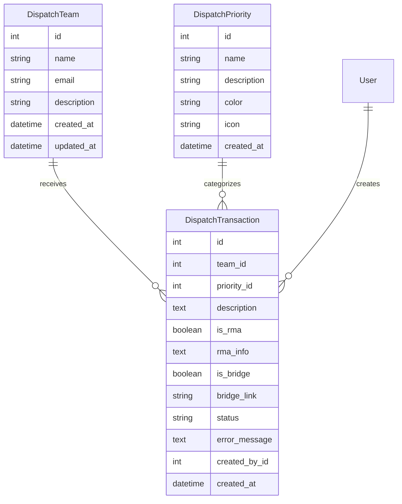
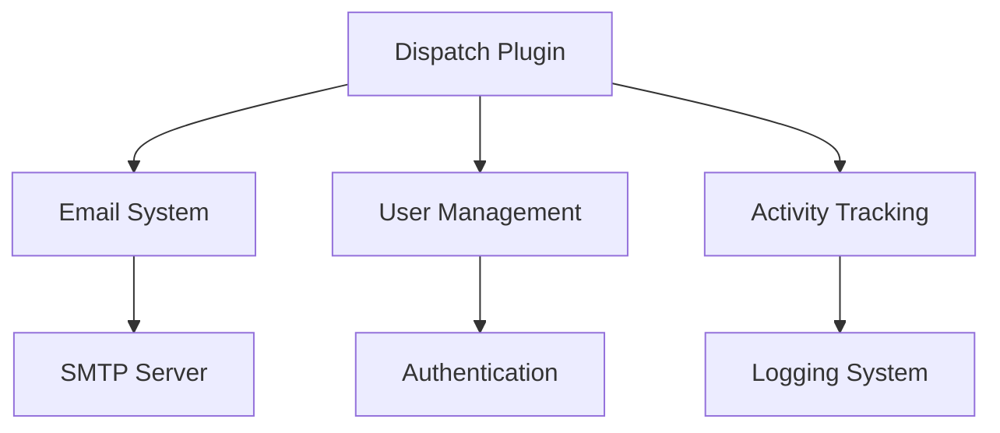

# Dispatch Plugin Documentation

## Overview

The Dispatch Plugin provides a robust system for managing and tracking dispatch requests with automated email notifications. It enables users to send structured dispatch requests to different teams, with customizable priorities and optional RMA (Return Merchandise Authorization) or bridge call information.

## Features

- Dispatch Request Management
  - Create and send dispatch requests
  - Configure teams and priorities
  - Track request status
  - Email notifications
  
- Team Management
  - Create and edit dispatch teams
  - Configure team email addresses
  - Team description and metadata
  
- Priority System
  - Customizable priority levels
  - Color-coded priorities
  - Priority-specific icons
  
- Additional Features
  - RMA tracking support
  - Bridge call integration
  - Transaction history
  - Status tracking

## Installation

1. Prerequisites
   - Flask application with SQLAlchemy
   - SMTP server configuration
   - Email settings in application config

2. Installation Steps
   ```python
   # Register the blueprint in your Flask application
   from app.plugins.dispatch import bp as dispatch_bp
   app.register_blueprint(dispatch_bp)
   
   # Initialize the plugin
   from app.plugins.dispatch import init_app
   init_app(app)
   ```

3. Configuration Requirements
   ```python
   # Required email configuration in config.py
   MAIL_SERVER = 'smtp.example.com'
   MAIL_PORT = 587
   MAIL_USE_TLS = True
   MAIL_USERNAME = 'username'
   MAIL_PASSWORD = 'password'
   MAIL_DEFAULT_SENDER = 'dispatch@example.com'
   ```

## Usage

### Basic Usage

```python
# Create a new dispatch request
from app.plugins.dispatch.models import DispatchTransaction

transaction = DispatchTransaction(
    team_id=1,
    priority_id=1,
    description="Urgent system maintenance required",
    created_by_id=current_user.id
)
db.session.add(transaction)
db.session.commit()
```

### Common Tasks

1. Sending a Dispatch Request
   - Navigate to Dispatch Tool
   - Select target team
   - Choose priority level
   - Enter description
   - Add RMA/Bridge info if needed
   - Submit request

2. Managing Teams
   - Access management interface
   - Add/edit team details
   - Configure team email
   - Save changes

## Configuration

### Settings

| Setting Name | Type | Default | Description |
|-------------|------|---------|-------------|
| url_prefix | str | /dispatch | URL prefix for dispatch routes |
| required_roles | list | ["user", "admin"] | Roles allowed to use dispatch |
| category | str | "Tools" | Navigation category |
| weight | int | 100 | Navigation menu weight |

### Environment Variables

| Variable Name | Required | Description |
|--------------|----------|-------------|
| MAIL_SERVER | Yes | SMTP server address |
| MAIL_PORT | Yes | SMTP server port |
| MAIL_USERNAME | Yes | SMTP authentication username |
| MAIL_PASSWORD | Yes | SMTP authentication password |

## Database Schema



## API Reference

### Endpoints

#### GET /dispatch/
Main dispatch interface

**Response:** HTML page with dispatch form and transaction history

#### POST /dispatch/submit
Submit new dispatch request

**Parameters:**
- team (int): Team ID
- priority (int): Priority ID
- description (str): Request description
- is_rma (bool): RMA flag
- rma_info (str): RMA details
- is_bridge (bool): Bridge call flag
- bridge_link (str): Bridge call URL

#### GET /dispatch/transactions
Get transaction history

**Response:**
```json
{
    "data": [
        {
            "id": 1,
            "team": "Team Name",
            "priority": "High",
            "description": "Request details",
            "created_by": "User Name",
            "created_at": "2024-01-01 12:00:00",
            "status": "sent"
        }
    ]
}
```

## Integration

### With Other Plugins



### Event Hooks

| Event Name | Description | Parameters |
|------------|-------------|------------|
| dispatch_created | New dispatch request created | transaction_id, team_id |
| dispatch_sent | Email notification sent | transaction_id, status |
| team_updated | Team details modified | team_id, changes |

## Troubleshooting

### Common Issues

1. Email Sending Failure
   - Symptoms: Failed status in transaction history
   - Cause: SMTP configuration or network issues
   - Solution: Check SMTP settings and server connectivity

2. Permission Errors
   - Symptoms: Access denied messages
   - Cause: Missing required roles
   - Solution: Ensure user has necessary roles assigned

## Security Considerations

- Authentication required for all routes
- Role-based access control
- Email server authentication
- Input validation and sanitization
- Secure SMTP communication with TLS
- Activity logging for audit trails

## Performance Tips

1. Email Handling
   - Use async email sending for large volumes
   - Implement email queue system
   - Monitor SMTP server response times

2. Database Optimization
   - Index frequently queried fields
   - Regular cleanup of old transactions
   - Optimize transaction queries

## Changelog

### Version History

| Version | Date | Changes |
|---------|------|---------|
| 1.0.0 | Initial | Core dispatch functionality |
| 1.1.0 | Update | Added RMA support |
| 1.2.0 | Update | Added bridge call integration |

## Support

- Report issues through the issue tracker
- Contact system administrators for urgent issues
- Review logs for troubleshooting

## Contributing

- Follow Flask blueprint conventions
- Maintain consistent code style
- Add tests for new features
- Update documentation
- Submit pull requests for review

## License

This plugin is part of the core system and follows the main project's license terms.

---

Note: This documentation assumes basic familiarity with Flask and email systems. For detailed implementation examples, refer to the code comments and inline documentation.
