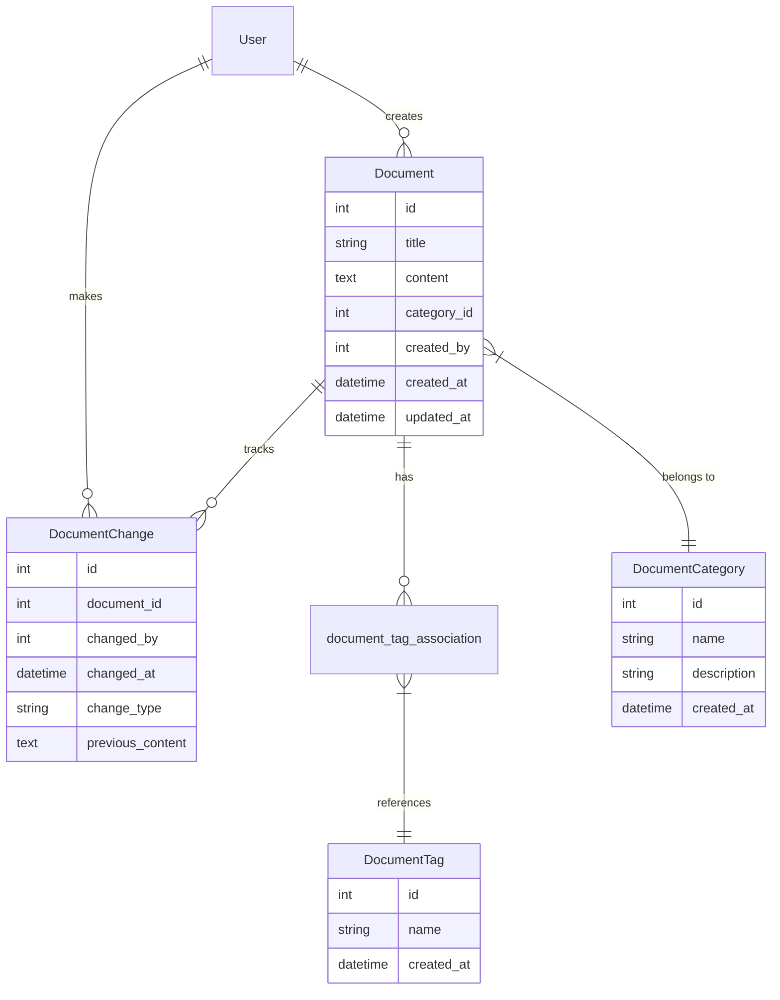
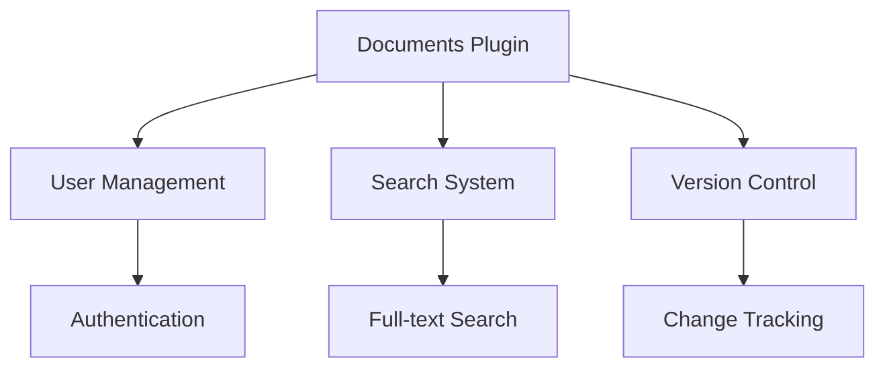

# Documents Plugin Documentation

## Overview

The Documents Plugin provides a comprehensive document management and knowledge base system. It enables users to create, edit, and organize rich text documents with support for categories, tags, and version history tracking. The system is designed for maintaining structured documentation with powerful search capabilities.

## Features

- Document Management
  - Rich text editing with TinyMCE
  - Category organization
  - Tag-based classification
  - Version history tracking
  
- Content Organization
  - Hierarchical categories
  - Flexible tagging system
  - Search functionality
  - Document metadata
  
- Version Control
  - Change history tracking
  - Previous content preservation
  - Audit trail of modifications
  
- Search Capabilities
  - Full-text search
  - Category filtering
  - Tag-based filtering
  - Combined search criteria

## Installation

1. Prerequisites
   - Flask application with SQLAlchemy
   - TinyMCE editor integration
   - Flask-WTF for forms

2. Installation Steps
   ```python
   # Register the blueprint in your Flask application
   from app.plugins.documents import bp as documents_bp
   app.register_blueprint(documents_bp)
   ```

3. Configuration Requirements
   ```python
   # Required database tables
   from app.plugins.documents.models import (
       Document,
       DocumentCategory,
       DocumentTag,
       DocumentChange
   )
   ```

## Usage

### Basic Usage

```python
# Create a new document
from app.plugins.documents.models import Document, DocumentCategory

category = DocumentCategory.query.first()
document = Document(
    title="Getting Started",
    content="<h1>Welcome</h1><p>Document content here...</p>",
    category_id=category.id,
    created_by=current_user.id
)
db.session.add(document)
db.session.commit()
```

### Common Tasks

1. Creating a Document
   - Navigate to Documents > Create New
   - Enter title and content
   - Select or create category
   - Add relevant tags
   - Submit the form

2. Managing Categories
   - Access category management
   - Create new categories
   - Add descriptions
   - Organize documents

## Configuration

### Settings

| Setting Name | Type | Default | Description |
|-------------|------|---------|-------------|
| url_prefix | str | /documents | URL prefix for document routes |
| required_roles | list | ["admin", "user"] | Roles allowed to access documents |
| category | str | "Documentation" | Navigation category |
| weight | int | 50 | Navigation menu weight |

### Environment Variables

| Variable Name | Required | Description |
|--------------|----------|-------------|
| TINYMCE_API_KEY | No | TinyMCE editor API key |
| MAX_CONTENT_LENGTH | No | Maximum document size |

## Database Schema



## API Reference

### Endpoints

#### GET /documents/
Main documents listing page

#### POST /documents/create
Create new document

**Parameters:**
- title (str): Document title
- content (str): HTML content
- category (int): Category ID
- new_category (str, optional): New category name
- tags (list): Selected tag IDs
- new_tags (str, optional): Comma-separated new tags

#### GET /documents/search
Search documents

**Parameters:**
- q (str): Search query
- category (int, optional): Category filter
- tag (int, optional): Tag filter

**Response:**
```json
[
    {
        "id": 1,
        "title": "Document Title",
        "category": "Category Name",
        "tags": ["tag1", "tag2"],
        "created_by": "username",
        "created_at": "2024-01-01 12:00",
        "updated_at": "2024-01-01 12:00"
    }
]
```

## Integration

### With Other Plugins



### Event Hooks

| Event Name | Description | Parameters |
|------------|-------------|------------|
| document_created | New document created | document_id |
| document_updated | Document modified | document_id, change_type |
| category_created | New category added | category_id |

## Troubleshooting

### Common Issues

1. Rich Text Editor Loading
   - Symptoms: Editor not displaying
   - Cause: TinyMCE configuration issues
   - Solution: Check API key and script inclusion

2. Search Performance
   - Symptoms: Slow search results
   - Cause: Large document database
   - Solution: Implement search indexing

## Security Considerations

- Authentication required for all routes
- Input sanitization for HTML content
- Version history for audit trails
- Role-based access control
- XSS prevention in rich text
- CSRF protection on forms

## Performance Tips

1. Content Management
   - Use efficient HTML sanitization
   - Implement content caching
   - Optimize search queries

2. Database Optimization
   - Index frequently searched fields
   - Implement pagination
   - Cache category and tag lists

## Changelog

### Version History

| Version | Date | Changes |
|---------|------|---------|
| 1.0.0 | Initial | Core document management |
| 1.1.0 | Update | Added tag support |
| 1.2.0 | Update | Added version history |

## Support

- Report issues through the issue tracker
- Review documentation for common solutions
- Contact system administrators for assistance

## Contributing

- Follow Flask blueprint conventions
- Maintain consistent code style
- Add tests for new features
- Update documentation
- Submit pull requests for review

## License

This plugin is part of the core system and follows the main project's license terms.

---

Note: This documentation assumes basic familiarity with Flask and document management concepts. For detailed implementation examples, refer to the code comments and inline documentation.
