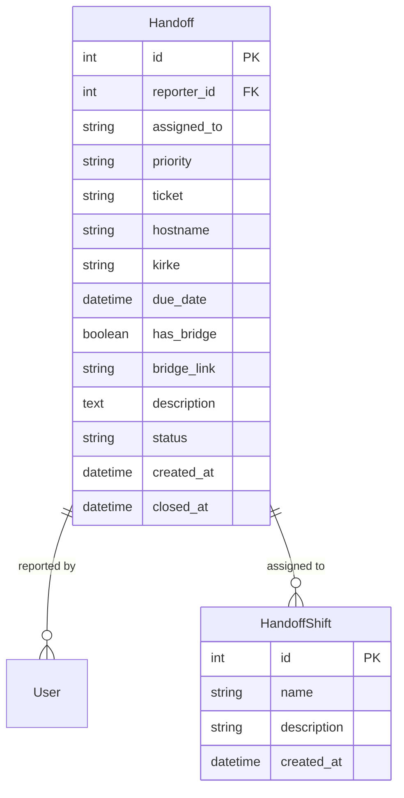

# Handoffs Plugin Documentation

## Overview

The Handoffs Plugin provides a comprehensive system for managing shift handovers between teams. It enables tracking of handoff tasks, metrics collection, and shift management with a focus on operational continuity.

## Features

- Handoff Management
  - Create and track handoff tasks
  - Priority-based organization (high, medium, low)
  - Shift assignment (1st, 2nd, 3rd)
  - Status tracking (open/closed)
  - Bridge call integration
  
- Metrics and Analytics
  - Real-time metrics dashboard
  - Completion rate tracking
  - Priority distribution analysis
  - Time-to-close statistics
  - Shift workload distribution
  
- Shift Management
  - Configurable shift definitions
  - Shift-based assignment
  - Workload tracking per shift

## Installation

1. Prerequisites
   - Flask application with SQLAlchemy
   - Flask-WTF for form handling
   - Required database tables (see Database Schema)

2. Installation Steps
   ```python
   # In your Flask application
   from app.plugins.handoffs import plugin
   
   def init_app(app):
       plugin.init_app(app)
   ```

3. Configuration
   ```python
   # Required configuration in config.py
   PLUGIN_HANDOFFS_ENABLED = True
   PLUGIN_HANDOFFS_CONFIG = {
       'default_shift': '1st',
       'metrics_retention_days': 30
   }
   ```

## Usage

### Creating a Handoff

```python
from app.plugins.handoffs.models import Handoff

handoff = Handoff(
    reporter_id=current_user.id,
    assigned_to='1st',
    priority='high',
    description='Critical system maintenance required',
    ticket='TICKET-123',
    hostname='prod-server-01',
    kirke='KIRKE-456'
)
db.session.add(handoff)
db.session.commit()
```

### Form Validation

The plugin includes comprehensive form validation:

```python
from app.plugins.handoffs.forms import HandoffForm

form = HandoffForm()
if form.validate_on_submit():
    # All fields validated successfully
    handoff = Handoff(
        assigned_to=form.assigned_to.data,
        priority=form.priority.data,
        description=form.description.data,
        # ... other fields
    )
```

Validation rules:
- Required fields: assigned_to, priority, description
- Length limits:
  - Description: 300 characters
  - Ticket: 100 characters
  - Hostname: 100 characters
  - KIRKE: 100 characters
- URL validation for bridge links
- Date format validation for due dates

## Database Schema



## API Reference

### Routes

#### GET /handoffs/
Main handoff interface showing open and closed handoffs

**Response:** HTML page with handoff listings

#### GET /handoffs/metrics
Metrics dashboard

**Response:** HTML page with metrics and statistics

#### POST /handoffs/create
Create new handoff

**Parameters:**
- assigned_to (required): Shift assignment
- priority (required): high, medium, low
- description (required): Task description
- ticket (optional): Ticket reference
- hostname (optional): System hostname
- kirke (optional): KIRKE reference
- due_date (optional): Task due date
- has_bridge (optional): Bridge call flag
- bridge_link (optional): Bridge URL

**Validation:**
- Description must not exceed 300 characters
- Ticket, hostname, and KIRKE must not exceed 100 characters
- Bridge link must be a valid URL
- Due date must be in valid datetime format

#### POST /handoffs/<id>/close
Close a handoff

**Parameters:**
- id (required): Handoff ID

**Response:**
```json
{
    "status": "success",
    "message": "Handoff closed successfully",
    "handoff_id": 123
}
```

## Error Handling

The plugin uses standardized error handling through PluginBase:

1. Database Errors
   - Automatic rollback
   - Error logging
   - User-friendly error messages

2. Validation Errors
   - Form-level validation
   - Field-specific error messages
   - Client-side validation support

3. Permission Errors
   - Role-based access control
   - Permission checking per route
   - Appropriate error responses

## Logging

The plugin implements comprehensive logging:

```python
# Log format
{
    'plugin': 'handoffs',
    'version': '1.0.0',
    'action': 'create_handoff',
    'details': {
        'handoff_id': 123,
        'assigned_to': '1st',
        'priority': 'high'
    }
}
```

## Testing

Run the test suite:

```bash
python -m pytest tests/test_handoffs_plugin.py
```

Test coverage includes:
- Plugin initialization
- Route functionality
- Form validation
- Model operations
- Error handling
- Metrics calculation

## Security

- Authentication required for all routes
- Role-based access control:
  - handoffs_access: Basic access
  - handoffs_create: Create handoffs
  - handoffs_close: Close handoffs
  - handoffs_metrics: View metrics
- Input validation and sanitization
- CSRF protection
- Activity logging

## Performance Considerations

1. Database Optimization
   - Indexed fields: status, created_at, closed_at
   - Regular cleanup of old records
   - Efficient query patterns

2. Metrics Calculation
   - Cached calculations for expensive metrics
   - Optimized date range queries
   - Background task processing for statistics

## Changelog

### Version History

| Version | Date | Changes |
|---------|------|---------|
| 1.0.0 | Initial | Core handoff functionality |
| 1.1.0 | Update | Added metrics dashboard |
| 1.2.0 | Update | Implemented PluginBase |

## Contributing

1. Follow Flask blueprint conventions
2. Maintain test coverage
3. Update documentation
4. Follow error handling patterns
5. Use standardized logging

## License

This plugin is part of the core system and follows the main project's license terms.

---

Note: This documentation assumes familiarity with Flask and SQLAlchemy. For detailed implementation examples, refer to the code comments and inline documentation.
