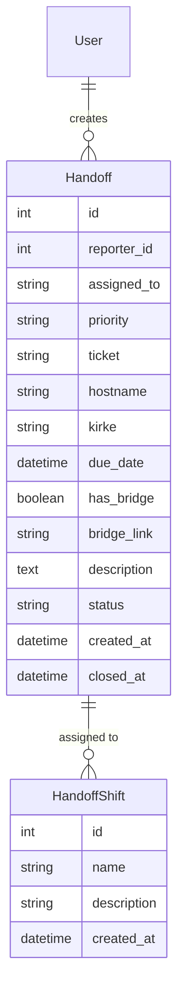
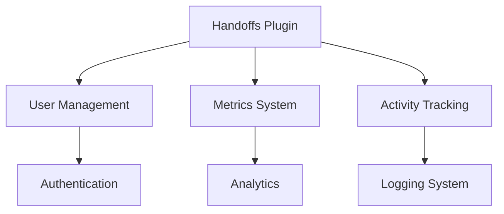

# Handoffs Plugin Documentation

## Overview

The Handoffs Plugin provides a comprehensive system for managing shift handovers between teams. It enables tracking of shift transitions, task assignments, and handover metrics with support for priority levels, due dates, and bridge calls. The system is designed to ensure smooth operational continuity across different shifts.

## Features

- Handoff Management
  - Create and track shift handovers
  - Priority levels (high, medium, low)
  - Due date tracking
  - Bridge call integration
  - Status tracking (open/closed)
  
- Shift Organization
  - Multiple shift support (1st, 2nd, 3rd)
  - Shift assignment tracking
  - Shift-based metrics
  
- Metrics and Analytics
  - Completion rates
  - Priority distribution
  - Average resolution time
  - Trend analysis
  - Shift-based statistics
  
- Additional Features
  - Ticket tracking
  - Hostname tracking
  - KIRKE reference support
  - Detailed descriptions
  - Historical data

## Installation

1. Prerequisites
   - Flask application with SQLAlchemy
   - Flask-WTF for forms
   - Database with user model

2. Installation Steps
   ```python
   # Register the blueprint in your Flask application
   from app.plugins.handoffs import bp as handoffs_bp
   app.register_blueprint(handoffs_bp)
   ```

3. Configuration Requirements
   ```python
   # Required database tables
   from app.plugins.handoffs.models import (
       Handoff,
       HandoffShift
   )
   ```

## Usage

### Basic Usage

```python
# Create a new handoff
from app.plugins.handoffs.models import Handoff

handoff = Handoff(
    reporter_id=current_user.id,
    assigned_to="1st",
    priority="high",
    description="Critical system update required",
    ticket="TICKET-123"
)
db.session.add(handoff)
db.session.commit()
```

### Common Tasks

1. Creating a Handoff
   - Navigate to Handoffs > Create New
   - Select shift assignment
   - Set priority level
   - Enter ticket/hostname/KIRKE info
   - Set due date if applicable
   - Add bridge call details if needed
   - Provide description
   - Submit handoff

2. Viewing Metrics
   - Access metrics dashboard
   - View completion rates
   - Analyze priority distribution
   - Track average resolution times
   - Monitor shift performance

## Configuration

### Settings

| Setting Name | Type | Default | Description |
|-------------|------|---------|-------------|
| url_prefix | str | /handoffs | URL prefix for handoff routes |
| required_roles | list | ["user"] | Roles allowed to use handoffs |
| category | str | "Operations" | Navigation category |
| weight | int | 100 | Navigation menu weight |

### Environment Variables

| Variable Name | Required | Description |
|--------------|----------|-------------|
| TIMEZONE | No | Default timezone for dates |
| MAX_DESCRIPTION_LENGTH | No | Maximum description length |

## Database Schema



## API Reference

### Endpoints

#### GET /handoffs/
Main handoffs listing page

#### POST /handoffs/create
Create new handoff

**Parameters:**
- assigned_to (str): Shift assignment
- priority (str): Priority level
- ticket (str, optional): Ticket number
- hostname (str, optional): System hostname
- kirke (str, optional): KIRKE reference
- due_date (datetime, optional): Due date
- has_bridge (bool): Bridge call flag
- bridge_link (str, optional): Bridge call URL
- description (str): Handoff details

#### GET /handoffs/metrics
View handoff metrics

**Response:**
```json
{
    "total_handoffs": 100,
    "open_handoffs": 25,
    "avg_time_to_close": 4.5,
    "completion_rate": 75,
    "priority_distribution": {
        "high": 30,
        "medium": 45,
        "low": 25
    }
}
```

## Integration

### With Other Plugins



### Event Hooks

| Event Name | Description | Parameters |
|------------|-------------|------------|
| handoff_created | New handoff created | handoff_id |
| handoff_closed | Handoff marked complete | handoff_id, duration |
| metrics_updated | Metrics recalculated | timestamp |

## Troubleshooting

### Common Issues

1. Due Date Handling
   - Symptoms: Invalid date format
   - Cause: Browser timezone mismatch
   - Solution: Use datetime picker

2. Metrics Loading
   - Symptoms: Slow metrics page
   - Cause: Large dataset
   - Solution: Implement caching

## Security Considerations

- Authentication required for all routes
- Input validation for all fields
- URL validation for bridge links
- XSS prevention in descriptions
- CSRF protection on forms
- Activity logging for audit trails

## Performance Tips

1. Metrics Calculation
   - Cache frequently accessed metrics
   - Use database aggregation
   - Implement periodic updates

2. Database Optimization
   - Index status and date fields
   - Archive old handoffs
   - Optimize metric queries

## Changelog

### Version History

| Version | Date | Changes |
|---------|------|---------|
| 1.0.0 | Initial | Core handoff functionality |
| 1.1.0 | Update | Added metrics dashboard |
| 1.2.0 | Update | Added bridge call support |

## Support

- Report issues through the issue tracker
- Review metrics for system health
- Contact system administrators for assistance

## Contributing

- Follow Flask blueprint conventions
- Maintain consistent code style
- Add tests for new features
- Update documentation
- Submit pull requests for review

## License

This plugin is part of the core system and follows the main project's license terms.

---

Note: This documentation assumes basic familiarity with Flask and shift management concepts. For detailed implementation examples, refer to the code comments and inline documentation.
