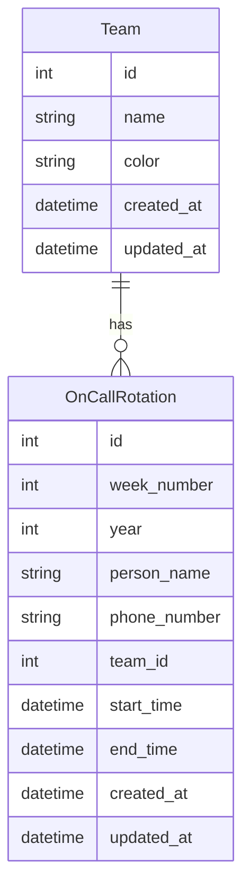
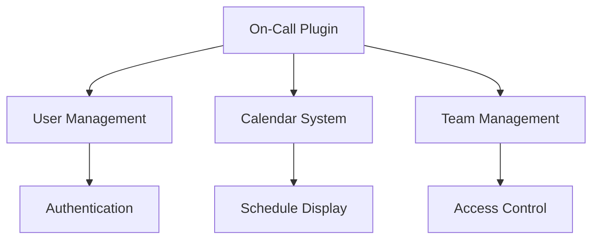

# On-Call Rotation Plugin Documentation

## Overview

The On-Call Rotation Plugin provides a comprehensive system for managing team on-call schedules. It enables organizations to track who is on-call across different teams, with support for weekly rotations, calendar visualization, and CSV-based schedule imports. The system is designed with a focus on timezone awareness (Central Time) and provides both current and future on-call information.

## Features

- Schedule Management
  - Weekly rotation scheduling
  - Multiple team support
  - CSV-based schedule import
  - Calendar visualization
  
- Team Organization
  - Team color coding
  - Team-based filtering
  - Custom team creation
  
- Current Status
  - Real-time on-call display
  - Phone number tracking
  - Shift timing information
  
- Export Capabilities
  - JSON export
  - CSV export
  - Schedule downloads

## Installation

1. Prerequisites
   - Flask application with SQLAlchemy
   - Flask-Login for authentication
   - Timezone support (pytz or zoneinfo)

2. Installation Steps
   ```python
   # Register the blueprint in your Flask application
   from app.plugins.oncall import bp as oncall_bp
   app.register_blueprint(oncall_bp)
   ```

3. Configuration Requirements
   ```python
   # Required database tables
   from app.plugins.oncall.models import (
       Team,
       OnCallRotation
   )
   ```

## Usage

### Basic Usage

```python
# Create a new on-call team
from app.plugins.oncall.models import Team, OnCallRotation

team = Team(name="Operations", color="primary")
db.session.add(team)
db.session.commit()

# Add rotation entry
rotation = OnCallRotation(
    week_number=1,
    year=2024,
    person_name="John Doe",
    phone_number="555-0123",
    team_id=team.id,
    start_time=start_datetime,
    end_time=end_datetime
)
db.session.add(rotation)
db.session.commit()
```

### Common Tasks

1. Creating Teams
   - Access team management interface
   - Enter team name
   - Select team color
   - Save team details

2. Importing Schedules
   - Prepare CSV with required columns (week, name, phone)
   - Select target team
   - Upload CSV file
   - Verify import results

## Configuration

### Settings

| Setting Name | Type | Default | Description |
|-------------|------|---------|-------------|
| url_prefix | str | /oncall | URL prefix for oncall routes |
| required_roles | list | ["admin", "demo"] | Roles allowed to manage oncall |
| category | str | "Operations" | Navigation category |
| weight | int | 100 | Navigation menu weight |

### Environment Variables

| Variable Name | Required | Description |
|--------------|----------|-------------|
| TIMEZONE | Yes | Default timezone (America/Chicago) |
| CALENDAR_FIRST_DAY | No | First day of calendar week |

## Database Schema



## API Reference

### Endpoints

#### GET /oncall/api/teams
List all teams

**Response:**
```json
[
    {
        "id": 1,
        "name": "Operations",
        "color": "primary"
    }
]
```

#### POST /oncall/api/upload
Upload schedule CSV

**Parameters:**
- file: CSV file with columns (week, name, phone)
- team: Team ID
- year: Schedule year

#### GET /oncall/api/events
Get calendar events

**Parameters:**
- start: Start date
- end: End date
- team: (optional) Team ID filter

**Response:**
```json
[
    {
        "id": 1,
        "title": "John Doe",
        "start": "2024-01-05T17:00:00-06:00",
        "end": "2024-01-12T17:00:00-06:00",
        "description": "Phone: 555-0123",
        "classNames": ["bg-primary"],
        "extendedProps": {
            "week_number": 1,
            "phone": "555-0123",
            "team": "Operations"
        }
    }
]
```

## Integration

### With Other Plugins



### Event Hooks

| Event Name | Description | Parameters |
|------------|-------------|------------|
| schedule_imported | New schedule imported | team_id, year |
| team_created | New team created | team_id |
| rotation_updated | Schedule updated | rotation_id |

## Troubleshooting

### Common Issues

1. CSV Import Errors
   - Symptoms: Import failure message
   - Cause: Invalid CSV format or data
   - Solution: Verify CSV structure and data

2. Timezone Issues
   - Symptoms: Incorrect shift times
   - Cause: Timezone conversion errors
   - Solution: Verify system timezone settings

## Security Considerations

- Role-based access control
- Admin privileges for management
- CSV validation and sanitization
- Input validation for all fields
- Secure file upload handling
- CSRF protection on forms

## Performance Tips

1. Schedule Management
   - Batch process CSV imports
   - Cache current on-call data
   - Index date-based queries

2. Calendar Optimization
   - Limit date range queries
   - Cache team color schemes
   - Optimize event retrieval

## Changelog

### Version History

| Version | Date | Changes |
|---------|------|---------|
| 1.0.0 | Initial | Core on-call functionality |
| 1.1.0 | Update | Added team management |
| 1.2.0 | Update | Added calendar integration |

## Support

- Report issues through the issue tracker
- Review CSV format documentation
- Contact system administrators for assistance

## Contributing

- Follow Flask blueprint conventions
- Maintain consistent code style
- Add tests for new features
- Update documentation
- Submit pull requests for review

## License

This plugin is part of the core system and follows the main project's license terms.

---

Note: This documentation assumes basic familiarity with Flask and on-call rotation concepts. For detailed implementation examples, refer to the code comments and inline documentation.
