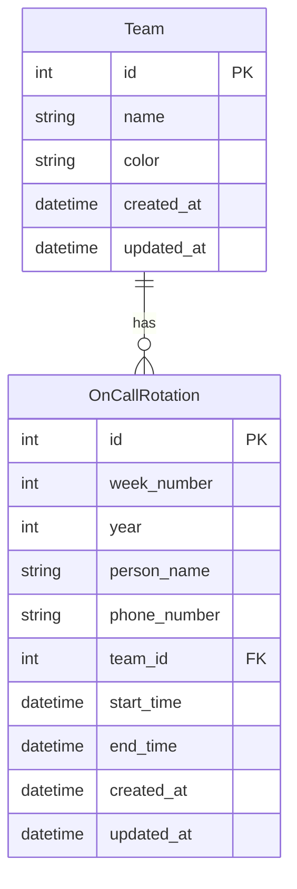

# On-Call Plugin Documentation

## Overview

The On-Call Plugin provides a comprehensive system for managing team rotation schedules. It enables teams to maintain and track on-call rotations with timezone-aware scheduling, CSV-based schedule imports, and a visual calendar interface.

## Features

- Team Management
  - Create and manage on-call teams
  - Customizable team colors
  - Team-specific rotation schedules
  
- Rotation Management
  - Weekly rotation schedules
  - Timezone-aware scheduling (Central Time)
  - CSV-based schedule imports
  - Current on-call status tracking
  
- Calendar Interface
  - Visual schedule display
  - Color-coded team events
  - Week/month views
  - Current rotation highlighting
  
- Additional Features
  - Contact information tracking
  - Schedule export (JSON/CSV)
  - Timezone conversion
  - Error handling and validation

## Installation

1. Prerequisites
   - Flask application with SQLAlchemy
   - Flask-WTF for form handling
   - Required database tables (see Database Schema)

2. Installation Steps
   ```python
   # In your Flask application
   from app.plugins.oncall import plugin
   
   def init_app(app):
       plugin.init_app(app)
   ```

3. Configuration
   ```python
   # Required configuration in config.py
   PLUGIN_ONCALL_ENABLED = True
   PLUGIN_ONCALL_CONFIG = {
       'timezone': 'America/Chicago',
       'rotation_start_day': 'Friday',
       'rotation_start_time': '17:00'
   }
   ```

## Usage

### Managing Teams

```python
from app.plugins.oncall.models import Team

# Create a new team
team = Team(
    name='Operations Team',
    color='primary'  # Bootstrap color class
)
db.session.add(team)
db.session.commit()
```

### Creating Rotations

```python
from app.plugins.oncall.models import OnCallRotation
from datetime import datetime, timedelta
import zoneinfo

# Create a rotation
central_tz = zoneinfo.ZoneInfo('America/Chicago')
start_time = datetime.now(central_tz)
end_time = start_time + timedelta(days=7)

rotation = OnCallRotation(
    week_number=1,
    year=2024,
    person_name='John Doe',
    phone_number='123-456-7890',
    team_id=1,
    start_time=start_time,
    end_time=end_time
)
db.session.add(rotation)
db.session.commit()
```

### CSV Import Format

```csv
week,name,phone
1,John Doe,123-456-7890
2,Jane Smith,098-765-4321
```

Required columns:
- week: Week number (1-53)
- name: Person's name
- phone: Contact phone number

## Database Schema



## API Reference

### Routes

#### GET /oncall/
Main on-call interface showing calendar and current rotation

**Response:** HTML page with calendar view

#### GET /oncall/api/teams
Get list of teams

**Response:**
```json
[
    {
        "id": 1,
        "name": "Operations Team",
        "color": "primary"
    }
]
```

#### POST /oncall/api/teams
Create new team

**Parameters:**
- name (required): Team name
- color (optional): Bootstrap color class (default: primary)

#### PUT /oncall/api/teams/<id>
Update team

**Parameters:**
- name (optional): New team name
- color (optional): New color class

#### DELETE /oncall/api/teams/<id>
Delete team

#### POST /oncall/api/upload
Upload rotation schedule

**Parameters:**
- file (required): CSV file
- team (required): Team ID
- year (optional): Schedule year (default: current year)

**CSV Format:**
- Required columns: week, name, phone
- Week numbers must be 1-53
- All fields must be non-empty

#### GET /oncall/api/events
Get calendar events

**Parameters:**
- start (required): Start date (ISO format)
- end (required): End date (ISO format)
- team (optional): Team ID filter

**Response:**
```json
[
    {
        "id": 1,
        "title": "John Doe",
        "start": "2024-01-05T17:00:00-06:00",
        "end": "2024-01-12T17:00:00-06:00",
        "description": "Phone: 123-456-7890",
        "classNames": ["bg-primary"],
        "extendedProps": {
            "week_number": 1,
            "phone": "123-456-7890",
            "team": "Operations Team",
            "team_id": 1
        }
    }
]
```

#### GET /oncall/api/current
Get current on-call rotation

**Parameters:**
- team (optional): Team ID filter

**Response:**
```json
{
    "name": "John Doe",
    "phone": "123-456-7890",
    "team": "Operations Team",
    "color": "primary",
    "start": "2024-01-05T17:00:00-06:00",
    "end": "2024-01-12T17:00:00-06:00"
}
```

## Error Handling

The plugin uses standardized error handling through PluginBase:

1. Database Errors
   - Automatic rollback
   - Error logging
   - User-friendly error messages

2. CSV Validation Errors
   - Format validation
   - Data integrity checks
   - Detailed error messages

3. Permission Errors
   - Role-based access control
   - Permission checking per route
   - Appropriate error responses

## Logging

The plugin implements comprehensive logging:

```python
# Log format
{
    'plugin': 'oncall',
    'version': '1.0.0',
    'action': 'upload_schedule',
    'details': {
        'team_id': 1,
        'team_name': 'Operations Team',
        'year': 2024,
        'rotation_count': 52
    }
}
```

## Testing

Run the test suite:

```bash
python -m pytest tests/test_oncall_plugin.py
```

Test coverage includes:
- Plugin initialization
- Team management
- Rotation management
- Calendar events
- CSV upload functionality
- Timezone handling
- Error handling

## Security

- Authentication required for all routes
- Role-based access control:
  - oncall_access: Basic access
  - oncall_manage: Team management
- Input validation and sanitization
- CSRF protection
- Activity logging

## Performance Considerations

1. Database Optimization
   - Indexed fields: start_time, end_time, team_id
   - Efficient date range queries
   - Timezone conversion caching

2. Calendar Performance
   - Event pagination
   - Lazy loading for large date ranges
   - Client-side caching

## Changelog

### Version History

| Version | Date | Changes |
|---------|------|---------|
| 1.0.0 | Initial | Core on-call functionality |
| 1.1.0 | Update | Added CSV import |
| 1.2.0 | Update | Implemented PluginBase |

## Contributing

1. Follow Flask blueprint conventions
2. Maintain test coverage
3. Update documentation
4. Follow error handling patterns
5. Use standardized logging

## License

This plugin is part of the core system and follows the main project's license terms.

---

Note: This documentation assumes familiarity with Flask and timezone handling. For detailed implementation examples, refer to the code comments and inline documentation.
