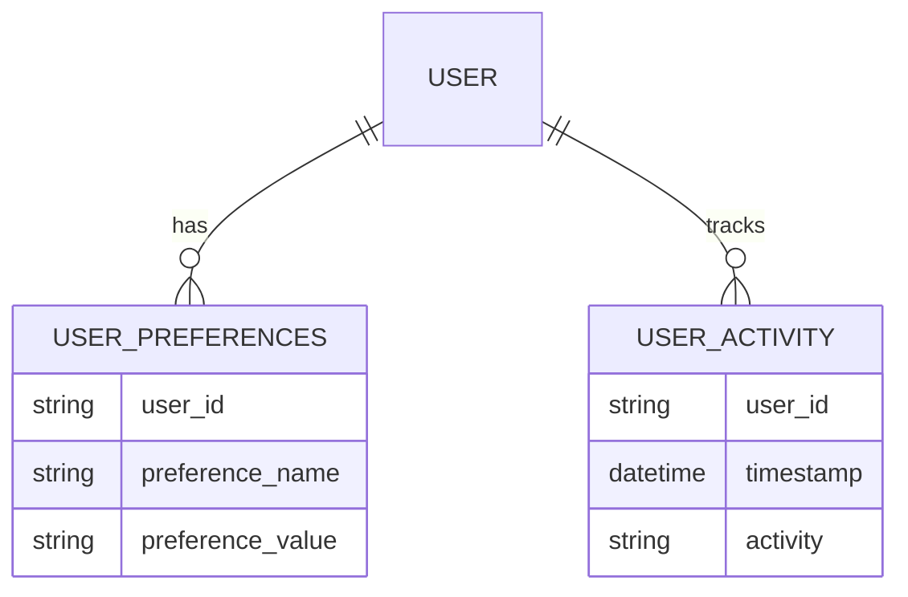

# Profile Plugin

## Overview

The Profile plugin helps users manage their personal settings in the Black Friday Lunch application. Think of it as your personal control center where you can change how your profile looks and works. You can upload a profile picture (avatar), choose between light and dark themes, and see a history of your activities.

## Features

- Choose and upload profile pictures (avatars)
- Switch between light and dark themes
- View your recent activities
- Pick from a collection of default avatars
- Automatic saving of your preferences

## Installation

The Profile plugin comes built into the Black Friday Lunch application. You don't need to install anything extra to use it.

### Requirements
- A user account in the Black Friday Lunch system
- Web browser with JavaScript enabled
- Less than 1MB of space for avatar uploads

## Usage

### How to Change Your Avatar

1. Go to your profile page
   - Click on the profile icon
   - Select "Profile" from the menu

2. Upload a New Picture
   - Click "Choose File"
   - Pick a picture from your computer
   - Click "Upload"
   - Your new picture should appear right away

3. Use a Default Avatar
   - Scroll through the default avatars
   - Click on the one you like
   - It will be set as your profile picture automatically

### How to Change Your Theme

1. Find the Theme Settings
   - Look for the theme toggle on your profile page

2. Choose Your Theme
   - Click "Light" for a bright theme
   - Click "Dark" for a darker theme
   - The change happens instantly

## Technical Details

### Settings

| Setting Name | What It Does | Default |
|-------------|--------------|---------|
| avatar      | Your profile picture | Random default avatar |
| theme       | Light or dark mode | Light |

### Rules for Avatars

- File types allowed: PNG, JPG, JPEG
- Maximum file size: 1MB
- Files are renamed automatically for security

### How Your Data is Stored



## API Reference

### Change Theme

**Endpoint:** POST /profile/preferences/theme

This lets you change your theme using JavaScript.

**What to Send:**
```json
{
    "theme": "light" or "dark"
}
```

**What You Get Back:**
```json
{
    "status": "success"
}
```

## Common Issues and Solutions

1. Avatar Won't Upload
   - Make sure your file is less than 1MB
   - Check that you're using PNG or JPG format
   - Try choosing a different picture

2. Theme Won't Change
   - Check your internet connection
   - Try refreshing the page
   - Clear your browser cache

## Security

- All avatar filenames are made safe before saving
- Only logged-in users can change their settings
- File types are checked to prevent unsafe uploads
- File size limits protect the server

## Activity Tracking

The plugin keeps track of:
- When you change your avatar
- When you update your theme
- Other important profile changes

You can see all these activities on your profile page.

## Future Updates

We plan to add:
- More theme options
- Custom color choices
- Additional profile settings
- Better image editing tools

---

Need help? Contact your system administrator or the Portal Team for support.
