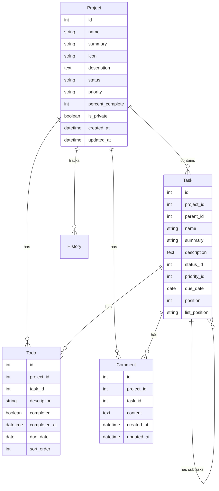
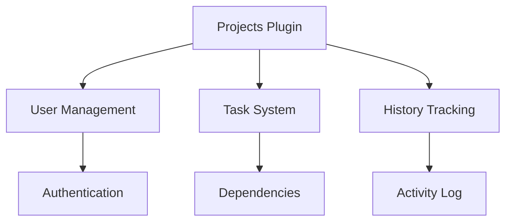

# Projects Plugin Documentation

## Overview

The Projects Plugin provides a comprehensive project management system with support for tasks, subtasks, todos, team collaboration, and activity tracking. It enables organizations to manage complex projects with hierarchical task structures, dependencies, and detailed progress tracking.

## Features

- Project Management
  - Project CRUD operations
  - Status and priority tracking
  - Progress monitoring
  - Private project support
  - Team collaboration
  
- Task System
  - Hierarchical tasks (up to 3 levels)
  - Task dependencies
  - Task ordering and positioning
  - Due date tracking
  - Status and priority management
  
- Team Collaboration
  - Project roles and permissions
  - Watchers, stakeholders, and shareholders
  - Comment system
  - Activity history
  
- Todo Management
  - Checklist functionality
  - Due date tracking
  - Assignment capabilities
  - Progress tracking

## Installation

1. Prerequisites
   - Flask application with SQLAlchemy
   - Flask-Login for authentication
   - JSON support for history tracking

2. Installation Steps
   ```python
   # Register the blueprint in your Flask application
   from app.plugins.projects import bp as projects_bp
   app.register_blueprint(projects_bp)
   
   # Initialize the plugin
   from app.plugins.projects import init_app
   init_app(app)
   ```

3. Configuration Requirements
   ```python
   # Required database tables
   from app.plugins.projects.models import (
       Project,
       Task,
       Todo,
       Comment,
       History,
       ProjectStatus,
       ProjectPriority
   )
   ```

## Usage

### Basic Usage

```python
# Create a new project
from app.plugins.projects.models import Project, ProjectStatus

project = Project(
    name="New Project",
    summary="Project description",
    status="active",
    priority="high",
    created_by=current_user.username
)
db.session.add(project)
db.session.commit()

# Add a task to the project
task = Task(
    project_id=project.id,
    name="Initial Task",
    description="Task details",
    created_by=current_user.username
)
db.session.add(task)
db.session.commit()
```

### Common Tasks

1. Creating Projects
   - Navigate to Projects > Create New
   - Enter project details
   - Set status and priority
   - Assign team members
   - Configure notifications

2. Managing Tasks
   - Create hierarchical tasks
   - Set dependencies
   - Track progress
   - Manage subtasks

## Configuration

### Settings

| Setting Name | Type | Default | Description |
|-------------|------|---------|-------------|
| url_prefix | str | /projects | URL prefix for project routes |
| required_roles | list | ["user", "admin"] | Roles allowed to access projects |
| category | str | "Tools" | Navigation category |
| weight | int | 200 | Navigation menu weight |

### Environment Variables

| Variable Name | Required | Description |
|--------------|----------|-------------|
| MAX_TASK_DEPTH | No | Maximum task hierarchy depth (default: 3) |
| ENABLE_NOTIFICATIONS | No | Enable notification features |

## Database Schema



## API Reference

### Endpoints

#### GET /projects/
List all accessible projects

#### POST /projects/create
Create new project

**Parameters:**
- name (str): Project name
- summary (str): Brief description
- description (text): Detailed description
- status (str): Project status
- priority (str): Project priority
- is_private (bool): Privacy setting

#### GET /projects/{id}
View project details

**Response:**
```json
{
    "id": 1,
    "name": "Project Name",
    "summary": "Project summary",
    "status": "active",
    "priority": "high",
    "percent_complete": 50,
    "tasks": [
        {
            "id": 1,
            "name": "Task Name",
            "status": "in_progress",
            "due_date": "2024-01-01"
        }
    ]
}
```

## Integration

### With Other Plugins



### Event Hooks

| Event Name | Description | Parameters |
|------------|-------------|------------|
| project_created | New project created | project_id |
| task_updated | Task modified | task_id, changes |
| todo_completed | Todo marked complete | todo_id |

## Troubleshooting

### Common Issues

1. Task Dependencies
   - Symptoms: Circular dependency error
   - Cause: Tasks depending on each other
   - Solution: Review dependency chain

2. Permission Issues
   - Symptoms: Access denied
   - Cause: Missing role assignments
   - Solution: Check project roles

## Security Considerations

- Role-based access control
- Private project support
- Team member permissions
- History tracking for audits
- Input validation
- XSS prevention
- CSRF protection

## Performance Tips

1. Task Management
   - Limit task hierarchy depth
   - Use efficient queries
   - Cache project statistics

2. History Tracking
   - Implement cleanup policies
   - Archive old history
   - Optimize queries

## Changelog

### Version History

| Version | Date | Changes |
|---------|------|---------|
| 1.0.0 | Initial | Core project functionality |
| 1.1.0 | Update | Added task dependencies |
| 1.2.0 | Update | Added team features |

## Support

- Report issues through the issue tracker
- Review documentation
- Contact system administrators

## Contributing

- Follow Flask blueprint conventions
- Maintain consistent code style
- Add tests for new features
- Update documentation
- Submit pull requests for review

## License

This plugin is part of the core system and follows the main project's license terms.

---

Note: This documentation assumes basic familiarity with Flask and project management concepts. For detailed implementation examples, refer to the code comments and inline documentation.
