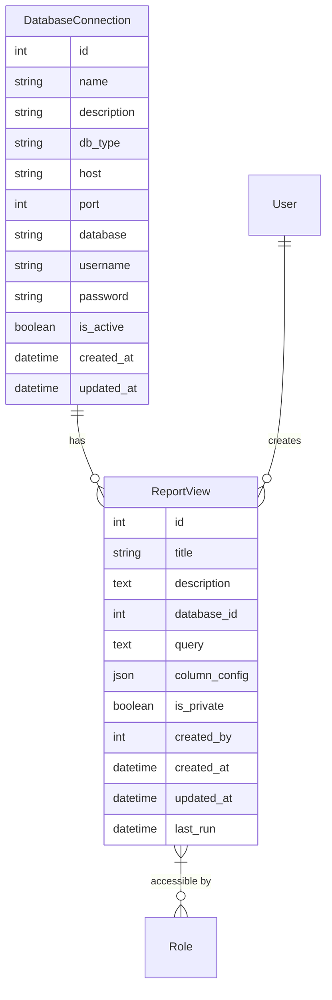
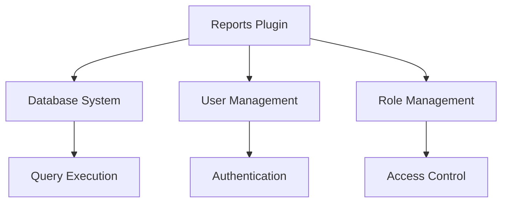

# Reports Plugin Documentation

## Overview

The Reports Plugin provides a self-service report generation system that enables users to create, manage, and view custom reports from multiple database sources. It supports various database types, custom query execution, and role-based access control for report views.

## Features

- Database Management
  - Multiple database connections
  - Support for MySQL, MariaDB, SQLite
  - Secure credential storage
  - Connection testing
  
- Report Views
  - Custom SQL queries
  - Column configuration
  - Data transformation
  - Private/Public views
  
- Access Control
  - Role-based permissions
  - Private report support
  - Admin-only database management
  
- Data Processing
  - Server-side transformations
  - Custom data formatting
  - JSON data export
  - Error handling

## Installation

1. Prerequisites
   - Flask application with SQLAlchemy
   - Database drivers (mysql-connector, sqlite3)
   - JSON support

2. Installation Steps
   ```python
   # Register the blueprint in your Flask application
   from app.plugins.reports import bp as reports_bp
   app.register_blueprint(reports_bp)
   ```

3. Configuration Requirements
   ```python
   # Required database tables
   from app.plugins.reports.models import (
       DatabaseConnection,
       ReportView
   )
   ```

## Usage

### Basic Usage

```python
# Create a database connection
from app.plugins.reports.models import DatabaseConnection

connection = DatabaseConnection(
    name="Production DB",
    db_type="mysql",
    host="localhost",
    port=3306,
    database="prod_db",
    username="user",
    password="pass",
    created_by=current_user.id
)
db.session.add(connection)
db.session.commit()

# Create a report view
view = ReportView(
    title="User Activity Report",
    database_id=connection.id,
    query="SELECT * FROM user_activity",
    column_config={
        "username": {"label": "User", "sortable": True},
        "activity": {"label": "Action", "filterable": True},
        "timestamp": {"label": "Date", "type": "datetime"}
    },
    created_by=current_user.id
)
db.session.add(view)
db.session.commit()
```

### Common Tasks

1. Creating Database Connections
   - Access database management
   - Enter connection details
   - Test connection
   - Save configuration

2. Creating Report Views
   - Select database connection
   - Write SQL query
   - Configure columns
   - Set permissions
   - Test and save view

## Configuration

### Settings

| Setting Name | Type | Default | Description |
|-------------|------|---------|-------------|
| url_prefix | str | /reports | URL prefix for report routes |
| required_roles | list | ["admin"] | Roles allowed to manage databases |
| category | str | "Admin" | Navigation category |
| weight | int | 100 | Navigation menu weight |

### Environment Variables

| Variable Name | Required | Description |
|--------------|----------|-------------|
| DB_ENCRYPTION_KEY | Yes | Key for database password encryption |
| MAX_QUERY_ROWS | No | Maximum rows per query result |

## Database Schema



## API Reference

### Endpoints

#### GET /reports/api/databases
List available database connections

**Response:**
```json
[
    {
        "id": 1,
        "name": "Production DB",
        "description": "Main production database",
        "db_type": "mysql"
    }
]
```

#### POST /reports/api/view/new
Create new report view

**Parameters:**
- title (str): View title
- database_id (int): Database connection ID
- query (str): SQL query
- column_config (json): Column configuration
- is_private (bool): Privacy setting
- roles (array): Allowed role IDs

#### GET /reports/api/view/{id}/data
Get report data

**Response:**
```json
{
    "data": [
        {
            "column1": "value1",
            "column2": "value2"
        }
    ],
    "columns": {
        "column1": {"label": "Column 1", "sortable": true},
        "column2": {"label": "Column 2", "filterable": true}
    }
}
```

## Integration

### With Other Plugins



### Event Hooks

| Event Name | Description | Parameters |
|------------|-------------|------------|
| view_created | New view created | view_id |
| query_executed | Query run successfully | view_id, duration |
| connection_added | Database added | connection_id |

## Troubleshooting

### Common Issues

1. Database Connection
   - Symptoms: Connection failure
   - Cause: Invalid credentials/config
   - Solution: Verify connection details

2. Query Execution
   - Symptoms: Query error
   - Cause: Invalid SQL or permissions
   - Solution: Test query and check access

## Security Considerations

- Encrypted database credentials
- Role-based access control
- Query validation
- SQL injection prevention
- Data transformation security
- Private view protection
- Admin-only database management

## Performance Tips

1. Query Optimization
   - Limit result sets
   - Index key columns
   - Cache frequent queries

2. Connection Management
   - Connection pooling
   - Timeout handling
   - Resource cleanup

## Changelog

### Version History

| Version | Date | Changes |
|---------|------|---------|
| 1.0.0 | Initial | Core reporting functionality |
| 1.1.0 | Update | Added data transformations |
| 1.2.0 | Update | Added role-based access |

## Support

- Report issues through the issue tracker
- Review query documentation
- Contact system administrators

## Contributing

- Follow Flask blueprint conventions
- Maintain consistent code style
- Add tests for new features
- Update documentation
- Submit pull requests for review

## License

This plugin is part of the core system and follows the main project's license terms.

---

Note: This documentation assumes basic familiarity with Flask and SQL databases. For detailed implementation examples, refer to the code comments and inline documentation.
