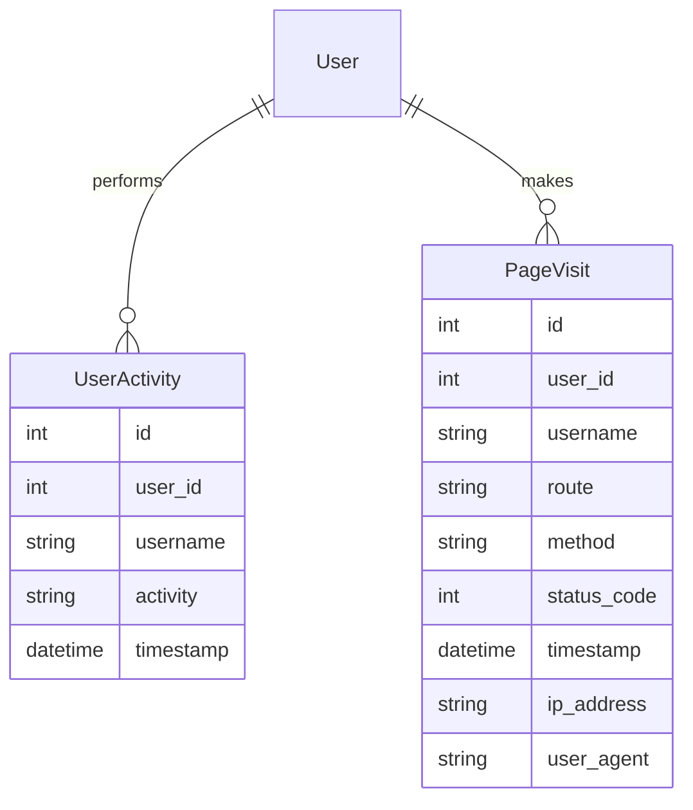
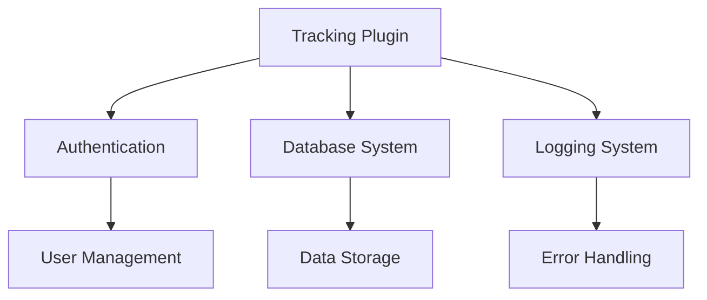

# Tracking Plugin Documentation

## Overview

The Tracking Plugin provides automatic request tracking and user activity monitoring for the application. It captures detailed information about page visits, user actions, and system usage patterns through request middleware integration.

## Features

- Request Tracking
  - Automatic request monitoring
  - Page visit logging
  - HTTP method tracking
  - Status code recording
  
- User Activity
  - User action logging
  - Authentication tracking
  - Activity timestamps
  - Username recording
  
- System Monitoring
  - IP address logging
  - User agent tracking
  - Route access patterns
  - Performance metrics
  
- Data Collection
  - Automated middleware
  - Static file filtering
  - Error handling
  - Database integration

## Installation

1. Prerequisites
   - Flask application with SQLAlchemy
   - Flask-Login for user authentication
   - Database for activity storage

2. Installation Steps
   ```python
   # Initialize tracking in your Flask application
   from app.plugins.tracking import init_tracking
   init_tracking(app)
   ```

3. Configuration Requirements
   ```python
   # Required database models
   from app.models import (
       UserActivity,
       PageVisit
   )
   ```

## Usage

### Basic Usage

```python
# Activity is automatically tracked for authenticated users
from app.models import UserActivity

# Manual activity logging if needed
activity = UserActivity(
    user_id=current_user.id,
    username=current_user.username,
    activity="Custom action description"
)
db.session.add(activity)
db.session.commit()
```

### Common Tasks

1. Monitoring User Activity
   - View activity logs
   - Filter by username
   - Track specific actions
   - Analyze patterns

2. Page Visit Analysis
   - Track route access
   - Monitor response codes
   - Analyze user agents
   - Review IP patterns

## Configuration

### Settings

| Setting Name | Type | Default | Description |
|-------------|------|---------|-------------|
| TRACK_STATIC | bool | False | Track static file access |
| LOG_USER_AGENT | bool | True | Record user agent info |
| TRACK_IP | bool | True | Record IP addresses |

### Environment Variables

| Variable Name | Required | Description |
|--------------|----------|-------------|
| TRACKING_ENABLED | No | Enable/disable tracking |
| LOG_LEVEL | No | Tracking log detail level |

## Database Schema



## API Reference

### Middleware Functions

#### track_request_start
Tracks the beginning of each request

**Tracked Information:**
- User ID
- Username
- Endpoint
- HTTP Method

#### track_request_end
Tracks the completion of each request

**Tracked Information:**
- Route path
- Response status
- IP address
- User agent
- Timestamp

## Integration

### With Other Plugins



### Event Points

| Event Point | Description | Data Captured |
|-------------|-------------|---------------|
| request_start | Request initiation | User, endpoint, method |
| request_end | Request completion | Status, duration, IP |
| user_activity | User action | Action details, timestamp |

## Troubleshooting

### Common Issues

1. Missing Activities
   - Symptoms: Actions not logged
   - Cause: Authentication issues
   - Solution: Verify user session

2. Performance Impact
   - Symptoms: Slow response times
   - Cause: Excessive logging
   - Solution: Optimize tracking filters

## Security Considerations

- IP address anonymization
- User agent sanitization
- Sensitive data filtering
- Access control for logs
- Data retention policies
- Error message security
- Database security

## Performance Tips

1. Request Tracking
   - Filter static files
   - Batch database writes
   - Implement caching
   - Use async logging

2. Data Management
   - Regular log rotation
   - Database indexing
   - Query optimization
   - Archive old records

## Changelog

### Version History

| Version | Date | Changes |
|---------|------|---------|
| 1.0.0 | Initial | Core tracking functionality |
| 1.1.0 | Update | Added user agent tracking |
| 1.2.0 | Update | Added IP logging |

## Support

- Report issues through the issue tracker
- Review tracking documentation
- Contact system administrators

## Contributing

- Follow Flask blueprint conventions
- Maintain consistent code style
- Add tests for new features
- Update documentation
- Submit pull requests for review

## License

This plugin is part of the core system and follows the main project's license terms.

---

Note: This documentation assumes basic familiarity with Flask and middleware concepts. For detailed implementation examples, refer to the code comments and inline documentation.

### Best Practices

1. Activity Logging
   - Log meaningful activities
   - Use consistent descriptions
   - Include relevant context
   - Maintain data privacy

2. Performance Monitoring
   - Monitor database size
   - Track response times
   - Analyze access patterns
   - Optimize queries

3. Security
   - Sanitize logged data
   - Protect sensitive information
   - Implement access controls
   - Regular security audits

4. Maintenance
   - Regular log rotation
   - Data archival strategy
   - Performance optimization
   - Database maintenance
